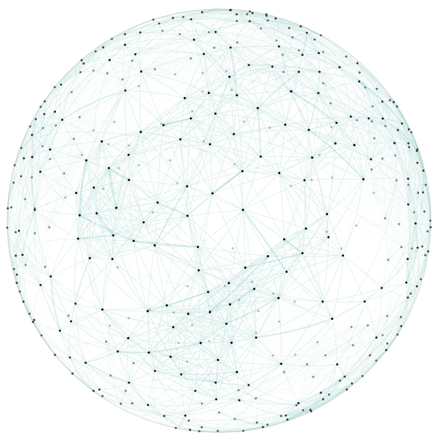

<h1 align="center">
  Nodino v2
</h1>

<p align="center">A deterministic, dependency-free 2D &amp; 3D force-directed graph viewer for the browser. <a href="https://efchi.github.io/nodino/"><b>Live Demo</b></a></p>

<p align="center">
  
</p>

---

Give Nodino a graph — just nodes and the edges between them — and it figures out where everything goes: a physics simulation pulls similar nodes together and pushes dissimilar ones apart until a layout emerges on its own. Watch it happen live, as a flat 2D disk or on the surface of a 3D sphere, and explore the result — pan, zoom, rotate, hover a node for detail, or jump straight to one with the built-in search and autocomplete.

> **Disclaimer:** Nodino is *entirely* vibe-coded with [Claude](https://claude.ai) — every line of it, top to bottom.

## Quickstart

No build step and no runtime dependencies. Ships as two static files: `nodino.js` and `nodino.css`.

Install from npm:

```sh
npm install @efchi/nodino
```

```js
import Nodino from '@efchi/nodino';
import '@efchi/nodino/nodino.css';
```

Or skip npm and use plain script tags — download the two files (or load them from a CDN, see [Installation](API-DOCS.md#installation)):

```html
<link rel="stylesheet" href="nodino.css" />
<div id="graph" style="position: relative; width: 100%; height: 100%;"></div>
<script src="nodino.js"></script>
<script>
  var nodino = Nodino.create(document.getElementById('graph'));
  nodino.load({ edges: [['apple', 'pear', 0.9], ['apple', 'hammer', -0.5]] });
  nodino.start();
</script>
```

## Features

- **Deterministic.** The same data and config produce the same layout on every machine, every run.
- **2D and 3D.** A flat unit disk, or the same graph laid out on the surface of a sphere — the same physics and the same readings on both, switchable at any time with one toggle.
- **Bounded cost at scale.** Symmetric kNN edge sparsification, viewport culling, and a spatial index keep the frame rate flat well past the point a naive force layout gives up.
- **Cache-ready.** Built-in support for caching the simulation's result and resuming from an already-computed layout, so you don't have to re-run the simulation every time.
- **Built-in controls, all optional.** Simulation controls, a uid search box with autocomplete, view/geometry toggles, a live tweak panel, pan/zoom/rotate with full touch support — each behind its own config flag, and gone from the DOM entirely when off, not just hidden.
- **A small, typed public API** — see [`API-DOCS.md`](API-DOCS.md).

## Integrating Nodino

The best way to use Nodino is probably with an AI: hand it [`API-DOCS.md`](API-DOCS.md) and [`CLAUDE.md`](CLAUDE.md) as context and it'll be able to integrate it into your application. A working [`demo.html`](demo.html) and the full [`nodino.dox.md`](nodino.dox.md) specification used to build Nodino are also available.

Nodino has no dependencies and needs no build step — the only requirements are `<canvas>`, Pointer Events, and `ResizeObserver`, which cover all current evergreen browsers, desktop and mobile.
