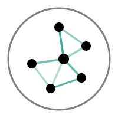

<p align="center">
  
</p>

<h1 align="center">Nodino 2</h1>

<p align="center">A deterministic, dependency-free 2D &amp; 3D force-directed graph viewer for the browser.</p>

> **Disclaimer:** Nodino is *entirely* vibe-coded with [Claude](https://claude.ai) — every line of it, top to bottom.

Nodino lays out a signed, weighted graph — positive weights attract, negative repel — and draws it live on a `<canvas>`, as a flat 2D disk or on the surface of a 3D sphere, the two being one toggle apart rather than separate modes: the same physics, the same readings, and the same interactions apply to both. It ships as two static files with no build step and no runtime dependencies: `nodino.js` (the engine and renderer) and an optional `nodino.css` for its built-in chrome (search box, view/geometry toggles, simulation controls, a debug panel, detail cards, readouts).

```html
<link rel="stylesheet" href="nodino.css" />
<div id="graph" style="position: relative; width: 100%; height: 100%;"></div>
<script src="nodino.js"></script>
<script>
  var nodino = Nodino.create(document.getElementById('graph'));
  nodino.load({ edges: [['apple', 'pear', 0.9], ['apple', 'hammer', -0.5]] });
  nodino.start();
</script>
```

## Features

- **Deterministic.** The same data and config produce the same layout on every machine, every run — no `Math.random()` anywhere in the engine.
- **2D and 3D, natively.** A flat unit disk, or the same graph laid out on the surface of a sphere — the same physics and the same readings on both, switchable at any time with one toggle. Not a projection of one onto the other: two real embeddings of the same graph.
- **Two readings, live.** `'relations'` shows every input edge as given; switch to `'proximity'` (once the layout settles) to see which nodes actually ended up near which, independent of what the input claimed.
- **Built-in chrome, all optional.** Simulation controls, a uid search box with autocomplete, view/geometry toggles, a live tweak panel, pan/zoom/rotate with full touch support — each behind its own config flag, and gone from the DOM entirely when off, not just hidden.
- **A small, typed public API.** `load` / `start` / `pause` / `forceContinue` / `restart` / `updateConfig` / `pin` / `hover` / `getStats` / `getPositions` / `getGlobePositions` / `destroy` — see [`API-DOCS.md`](API-DOCS.md).
- **Bounded cost at scale.** Symmetric kNN edge sparsification, viewport culling, and a spatial index keep the frame rate flat well past the point a naive force layout gives up.

## Where to start

- **Using Nodino in a page?** [`demo.html`](demo.html) is a full working embed — every data source (random generation, pasted/imported JSON, exported round-trip) alongside the debug panel. [`API-DOCS.md`](API-DOCS.md) is the full interface reference — every method, config field, callback, and UI feature.
- **Extending or modifying the library, by hand or with an AI agent?** [`CLAUDE.md`](CLAUDE.md) covers the project's hard invariants and how to extend it safely; [`nodino.dox.md`](nodino.dox.md) is the full as-is specification — every behavior and the reasoning behind it.

## Files

| File | What it is |
|---|---|
| `nodino.js` | The library. One file, no build step. |
| `nodino.css` | Optional chrome styling — only needed if any of the built-in UI is turned on. |
| `demo.html` | Full exerciser, with the debug/tweak panel. |
| `API-DOCS.md` | Developer-facing API reference. |
| `CLAUDE.md` | Guidance for AI agents working on this codebase. |
| `nodino.dox.md` | The as-is specification — what the library does and why, in detail. |

## Browser support

Anything with `<canvas>`, Pointer Events, and `ResizeObserver` — all current evergreen browsers, desktop and mobile.
