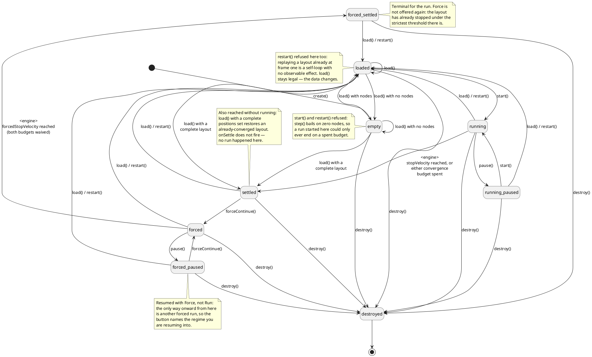

# Nodino v2 — Specification

| | |
|---|---|
| **Project** | Nodino v2 |
| **Status** | Stable — reflects the current implementation (`nodino.js`, `nodino.css`, `demo.html`, `assets/examples/usage-example.html`) |
| **Notation** | [Dox](../dox/.dox/Dox.md) v1.8.1 |
| **Predecessor** | Nodino (PoC) — a single-file, O(n²), non-interactive force-directed demo with no id/data model to speak of; not kept in this repo |
| **Deliverable** | `nodino.js` (core library) + `nodino.css` (UI chrome styling) + `demo.html` (standalone demo) + `assets/examples/usage-example.html` (minimal getting-started page) |

This document describes what Nodino v2 *is* — the implemented behavior, the API surface, and the major design decisions behind it. It is the as-is: it records decisions and the reasoning that is still load-bearing, plus the open points, debts and risks below. It is not a changelog, and no file in this project keeps one — where an alternative is documented, it is because someone would otherwise try it again, not to note that it was once tried.

## Overview

Nodino v2 is an embeddable force-directed graph viewer: a JS library for visualizing generic weighted graphs (documents, entities, anything), where edge weight represents a similarity/correlation in `[-1, 1]` (e.g. cosine similarity between embeddings, but not necessarily). It renders a layout via stress-majorization physics, animated on a canvas with pan/zoom/hover/pin, and ships with a demo page.

It offers **two geometries** for the same graph ([D Globe.1]): a flat unit disk, and the surface of a sphere with edges drawn as paths along it. Both are laid out by the same physics re-derived for the space, both are stepped whenever the simulation runs, and every reading of the graph exists in both — so the toggle between them is a change of viewpoint and never of state.

**[G 1]** Handle weighted graphs up to roughly 1,000–5,000 nodes at interactive framerates, as a reusable component embeddable in other projects.

## Scope

**In scope:** sparse weighted graphs as input; deterministic force-directed layout in either geometry ([D Globe.1]); canvas rendering with pan/zoom/rotate/hover/pin; uid search with autocomplete ([F Search.1]); a host-facing API (`load`/`start`/`pause`/`restart`/`updateConfig`/`pin`/`hover`); a debug/tweak panel for development.

**[FR Scope .W]** Explicitly out of scope for this iteration: manual node dragging/editing, automatic clustering/community detection, server-side persistence, multi-user real-time collaboration.

**3D layout was on this list and has been taken off it.** What shipped is deliberately not the general case: nodes live on the *surface* of a sphere, never inside it, so the layout is still two-dimensional — a curved 2-manifold rather than a volume. That keeps every node visible from somewhere, keeps occlusion to a single sign test instead of a depth sort, and keeps the physics a re-derivation of the existing one rather than a new one. A free 3-D volume layout remains out of scope.

## Data Model

**[F Data.1]** Input to `load()` is `{ nodes?, edges, positions?, globePositions? }`:
- `nodes?: { [uid: string]: { m?: object } }` — optional dictionary. The key *is* the node's host-facing identifier (`uid`); uniqueness is structural (object keys can't collide). `m` (metadata) is opaque to Nodino — no `title`/`label` field, any display text is the host's concern. Named at one character because it repeats once per node in a payload that can carry thousands of them — the same compactness argument that makes edges positional tuples below. `m` is also the name it comes back under in `onNodeHover` ([F API.3]): one concept, one name, in and out.
- `edges: [uid, uid, weight][]` — mandatory (can be empty). A positional tuple, not an object, chosen for compactness. `weight` is clamped to `[-1, 1]`; non-finite values default to `0`; self-loops (`a === b`) are dropped.
- `positions?: { [uid]: { x, y } }` — optional bootstrap coordinates (`x`/`y` in `[-1, 1]`), used instead of the default circular placement. Can be partial — nodes without an explicit position still get the default placement. An unknown `uid` is ignored with a console warning. Covering *every* node changes what the payload is, and what `load()` does with it — see [D Data.3].
- `globePositions?: { [uid]: { x, y, z } }` — the same thing for the spherical layout ([D Globe.9]), and entirely independent of `positions`: either, both or neither may be present, each is partial-capable on its own terms, and neither is derived from the other. Vectors are renormalized onto the unit sphere on the way in, so a value rounded through JSON does not start the run off the surface. Note that only `positions` coverage decides the lifecycle state ([D Data.3]) — a complete `globePositions` settles the sphere's engine, nothing more.

**[D Data.3] A complete `positions` set is a layout, not a seed.** When every node arrives with a position, the data is not a graph waiting to be laid out: it is a layout someone has already computed — restored from a cache, or handed over by whoever ran it. `load()` therefore opens it the way a converged run is left: state `settled` and view mode `proximity` ([D View.1]). Nothing steps, and nothing needs to: the result is the thing being shown. Paired with `maxFrames` ([F Data.4]) the restore is complete — the layout and the record of what produced it, in one payload.

**Coverage, not presence, is the test.** A partial bootstrap leaves the remaining nodes on the default circle, so it cannot be a result by construction; it stays exactly what it always was, a seed for a run that lands in `loaded` and waits for Run. That keeps the seeding use case intact and asks the host for no new field — the data already says which of the two it is, and completeness is a property the host cannot get wrong by accident.

**No `onSettle` fires for a restored layout.** It reports what a *run* reached ([F API.6]), and this instance ran nothing: `reason` would be a verdict on a run that never happened. The perimeter likewise shows the settled look outright rather than easing into it — there was no convergence here to animate.

**The step count is restored along with the positions.** `frames` opens at the payload's `maxFrames` rather than at `0` ([D API.7]): nothing has run here, but something ran to produce what is on screen, and that is what `frames` counts. This is what makes **Force** on a restored layout an improvement rather than a fresh start — it adds steps to the cached total, so the run it ends reports more than it began with and the host has a correct reason to re-cache ([D API.8], [Opn 3]).

**Both ways out of a restored layout already exist**, which is why this needs no verb of its own. **Force** continues from where the cached run stopped, under the stricter `forcedStopVelocity` ([F API.4]) — precisely the "improve on the cached result" step the caching this serves is for. **Reset** replays from the given positions rather than from any circle ([D API.1]) and lands in `loaded`, where Run is legal again — with `frames` back at the cached count, since that is what those positions cost. Restoring a layout never traps the graph in it.
- `maxFrames?: number` — optional. The best step count any *previous* run of this graph reached, as the host has it stored. It seeds the high-water mark `onSettle` reports against ([F API.6]), and — when `positions` cover every node — the running `frames` count as well ([D API.7]); absent, non-numeric or negative all mean "no history" rather than an error, so a host with nothing cached simply leaves it off and a value mangled in transit degrades to that same case instead of poisoning every later comparison.

**[F Data.4] `maxFrames` travels with the data because it is a fact about that data.** It is the one field of the input that describes the graph's *history* rather than its content, and it is in `load()`'s data rather than in `load()`'s options for the same reason every other field is: a host restoring a cached graph hands back the record it stored alongside it, in one payload, and can't pair the record of one graph with the nodes of another. It is read fresh on every `load()` and never carried over from the outgoing dataset, whose record belonged to a different graph.

**It has two readings, and `positions` coverage decides which applies** ([D Data.3]). As the *record* it always seeds `maxFrames` — a host may remember how far a graph once got without storing the layout that got there. As the *cost of the layout on screen* it seeds `frames` only when the payload carries a complete layout, because only then is there a layout it is the cost of: against a partial bootstrap it would credit a handful of hint coordinates with thousands of steps that produced no part of them.

**[D Data.1]** A node does not need to be declared in `nodes` to exist: the node set is the **union** of `nodes` keys and every `uid` referenced by an edge (with `m = null` if undeclared). A graph can be described with `edges` alone.

**[D Data.2]** Weight semantics: `+1` = maximal attraction, `-1` = maximal repulsion, `0` (or an absent edge) = no relation, contributing zero force. Both signs are first-class information, not just "hit vs. background noise" — this is why negative edges survive sparsification and get their own color channel (see Rendering).

**[F Data.2]** Internally, every node gets an opaque integer `nid` (array index) — a black box never exposed to the host, used only for typed-array indexing. `nid` assignment is **deterministic**: the node set is sorted lexicographically by `uid` (UTF-16 code-unit order, not locale-aware) before indices are handed out, so layout depends only on the *set* of input uids, never on host iteration order.

**[F Data.3]** Edges are stored as parallel typed arrays (`Int32Array` endpoints, `Float64Array` weights), not one object per edge — at the scale target, per-edge object allocation and cache misses cost more than the physics step itself.

## Physics Engine

**[F Phys.1]** Stress-majorization on sparse edges only, O(E) not O(n²): each edge pulls/pushes its endpoints toward an "optimal" distance `restLength * (1 - weight)`, which lands in `[0, 2]` — the unit disk's diameter — so weights map onto available space with no extra length parameter. Force magnitude scales with `|weight|`, which is what makes `weight = 0` truly inert (an unscaled force would pull a zero-weight edge just as hard as any other).

**[D Phys.1]** A negative-weight edge **repels only** — it pushes apart while closer than optimal, but never pulls back once farther. Treating "maximally repulsive" as an equality (sit at exactly distance 2) is unsatisfiable for more than one pair at a time: the constraints fight forever and the layout never converges. As an inequality, it's simultaneously satisfiable and the system settles normally.

**[F Phys.2]** Edge forces are normalized by node **degree** (sum → mean), so a 500-edge hub doesn't receive 500× the pull of a leaf. Generic crowding repulsion between all nearby nodes (not just edge-connected ones) uses a uniform spatial grid, normalized by **neighbor count** (mean, not sum) for the same reason, with a crowding radius `repulsionSpacing / sqrt(nodeCount)` that keeps the number of repelled neighbors roughly constant as the graph grows.

**The degree is counted per step, over the edges that actually contributed** — those carrying a non-zero weight and passing the compute thresholds ([F Phys.5]) — rather than fixed at build time from the sparsified edge set. The divisor has to match the sum, and the thresholds are live config the engine re-reads every step: a build-time degree went on dividing by edges a raised threshold had just excluded, so raising one scaled every force down instead of filtering the layout. At the default thresholds (`0`, nothing excluded) the two are identical, which is why this went unnoticed.

**A zero-weight edge is excluded from the count outright**, and that is what makes `weight = 0` fully equivalent to an absent edge ([D Data.2]) rather than only nearly so. The `|weight|` factor ([F Phys.1]) zeroes such an edge's *force*, which is half of it; counted into the divisor anyway it went on diluting the edges that did pull, so a node's real relations came out weaker for the company of one that asserted nothing. This is also the guard on a malformed input weight: a non-finite value becomes `0` on the way in ([F Data.1]), and should therefore cost its endpoints exactly nothing.

**[D Phys.2] Scale invariance.** The engine works in a **normalized unit disk**: after every step the layout is recentered on its centroid and rescaled so the farthest node sits exactly at radius 1 (a similarity transform — shape is preserved, only size/position change). Consequence: no config parameter carries a length unit, node coordinates are guaranteed to be in `[-1, 1]` by construction, and the same parameters work at any graph size without re-tuning. A hard per-frame displacement cap (`maxStep`, in disk radii) bounds how far any node can move regardless of parameter values, guaranteeing the system can't diverge.

**[F Phys.3]** Convergence: damped integration (`damping`) with a growing force multiplier (`epsilon`, ramping from `epsilonStart` towards `epsilonMax` and pinned to it from **either** side, so lowering `epsilonMax` mid-run takes effect immediately instead of being a silent no-op once epsilon has already climbed past the new value); the layout is considered **settled** once average post-normalization movement stays below the applicable stop threshold for `stopFrames` consecutive steps (movement is measured after re-normalization, not raw velocity, since a contracting-while-renormalized layout has permanent velocity but zero net movement). Which threshold applies depends on the lifecycle state: `stopVelocity` in `running`, the stricter `forcedStopVelocity` in `forced` — see [D State.2].

**[F Phys.4] Convergence guarantee — two budgets.** If the layout hasn't settled naturally, the engine is forced to `settled` — same effect as organic convergence — as soon as either of two limits is spent:

- **`physics.maxConvergenceSeconds`** (default `5`) — seconds of *running* time, measured against `runElapsedMs` ([D Render.4]) rather than wall-clock, so a pause does not consume it. Bounds what the user waits.
- **`physics.maxConvergenceFrames`** (default `7200`) — simulation steps. Bounds the work done.

`0` disables either; both at `0` lets a run go as long as it takes. `reason` reports which one fired — `'timeout'` or `'capped'` ([F API.6]). **At the defaults the seconds budget is what ends a run** on any machine below 1440 steps/s; `7200` (the old 120-second default at 60fps) stays behind it as the backstop that still bounds a run for a host that sets seconds to `0`, that being the reproducible ending and so the right one to fall back on. `demo.html` lowers the step budget to a value the two actually compete over ([F Demo.1]). Both apply in the `running` state only: `forced` waives them outright ([F API.4]), and no other state is stepping. Both are checked *before* each step, so a run stopped by the step budget performs exactly `maxConvergenceFrames` of them; and both count **this run**, from the moment the current layout was built, so a graph restored from a cache gets the whole allowance rather than what is left of it ([D API.7]). A tie on the same step goes to the step budget, that ending being the reproducible one.

**[D Phys.3] Why two units, and why neither alone.** They answer questions that are not the same question, and either one alone gives up something the other has.

**Steps, because a wall-clock budget makes the *result* a property of the machine.** Steps are executed one per driver tick, so how many fit inside a wall-clock budget is exactly the framerate. Replaying one graph five times under a seconds-only limit gave 312, 88, 320, 318, 320 steps — the spread ordinary framerate jitter, the outlier a run whose window lost focus (`rAF` is suspended outright while a tab or window is hidden, thinned under load, skipped across a long GC, while the clock advances through all of it). A budget in steps ends a cut-off run at the same step everywhere, which is what makes one run's `frames` comparable with another's ([F API.6]).

**Seconds, because the wait is the thing the user is owed a number for.** A step budget bounds the work, not the waiting — and waiting is what a person experiences. The same 500 steps is a bit over 8 seconds on a 60Hz display, 4 on a 120Hz one, and considerably more where the physics itself is the bottleneck; a budget of 7200 could be two minutes or twenty. A widget that cannot say how long it will keep you waiting is missing the one quantity the user is actually counting, and the colleague on the weaker laptop is the person that omission lands on.

So neither subsumes the other: **seconds bound the waiting and let the result vary; steps bound the result and let the waiting vary.** Setting both says "no longer than this, and no more work than this", and the run stops at whichever arrives first.

**[D Phys.5] A machine-dependent stopping point is affordable because the client only makes a proposal.** With a seconds budget in play, where a cut-off run stops is a property of the machine again — the exact thing the move to steps had removed. What makes that acceptable is not a change in the physics but a change in who decides, and it is worth being explicit about the arrangement the caching path ([Opn 3]) assumes.

`onSettle` is a **proposal**, never a verdict. The host offers a result to whatever stores it, and the store is free to refuse. Three consequences follow.

- **Framerate jitter cannot corrupt the record.** The 88-step outlier above proposes 88 and is refused by a store already holding 320. The record moves monotonically towards the best result anyone has produced; a slow machine contributes less often rather than contributing damage. The objection that a seconds budget makes a cached record churn is an objection to a *client* deciding for itself, which is not the arrangement.
- **Determinism is untouched.** [F Det.1] is a property of the step, not of the budget: the same graph and config at the same step count is the same layout, whoever ran it and however fast they got there. Two machines that both reach 5000 steps agree; one merely takes longer. That is what lets colleagues share a graph and share results at all, and no choice of stopping rule affects it.
- **What is genuinely lost is narrow.** Not determinism — the reproducibility of *where a cut-off run stops*. Tweak a parameter, Reset, Run, and the difference you see is no longer attributable to the tweak alone, since the run may also have ended at a different step. That is a cost at the workbench rather than in the product, and it is one field away from being paid back: `maxConvergenceSeconds = 0` restores the deterministic ending for as long as it is wanted.

**What the store needs from a proposal is not only the step count.** A run that *converged* at 500 steps is a better result than one cut off at 5000: the first is finished, the second is not. That is why `reason` travels with `frames` ([D API.8]), and why the two cut-off endings are reported separately instead of as one `'capped'`. `'timeout'` says this machine ran out of patience — try again on a faster one, or with a longer budget. `'capped'` says the run did all the work it was allowed — the budget itself is what to raise. A store that sees only "unfinished" cannot tell those apart, and they call for opposite responses.

**[D Phys.4] A run continues while the page is hidden.** Steps are normally driven one per `requestAnimationFrame` callback, and the browser suspends rAF outright for a hidden page: a run left in a background window would otherwise stop dead until that window came back. It should not — a layout does not need to be *watched* to advance, and switching to another application for a minute is not an instruction to pause. So the simulation has a second driver, active exactly while the page is hidden and stepping: `tick()` (the step, the engine-driven transitions, the chrome that tracks them) is split out from `frame()` (the paint), and only the former runs in the background. There is nothing to paint to meanwhile, and the pending redraw carries over to the first visible frame on its own.

Exactly one driver is live at a time, reconciled on every visibility change and every state transition — so a run that converges while hidden shuts its own driver down, and the rAF loop, which keeps itself alive throughout, skips its step while the background one owns the simulation. Stepping twice in an overlapping frame would not just double the rate: it would make the step count depend on how the two interleave, which is the one thing [D Phys.3] exists to prevent.

The background tick comes from a dedicated worker whose only job is to post an empty message on an interval — no physics crosses the thread boundary. A plain `setInterval` on the page would be clamped to 1 Hz while hidden, and to one per minute after five minutes, leaving the simulation technically alive and practically frozen; worker timers are exempt from that clamping. A Content-Security-Policy without `worker-src blob:` forbids the worker, and the fallback is that clamped interval — a crawl rather than a stop, and the only part of this a host's CSP can take away. The failure is caught from both directions, constructor exception and `onerror`: browsers do not agree on which one a blocked worker produces, and the asynchronous route would otherwise leave a ticker that never ticks and a simulation silently stopped — the exact failure this whole mechanism exists to prevent.

**[F Phys.5]** Two independent threshold pairs gate whether an edge contributes force at all (`hitThresholdCompute`/`missThresholdCompute`, one per sign, default `0`) — distinct from the *drawing* thresholds below; an edge can exert force without being drawn, or vice versa.

### Determinism

**[F Det.1]** No `Math.random()` anywhere in `nodino.js`. Initial placement is nodes evenly spaced on the unit circle in `nid` order (or at a bootstrap `positions` coordinate, if given); the physics step advances by a fixed increment per driver tick — a `requestAnimationFrame` callback normally, a background one while the page is hidden ([D Phys.4]) — never reading real elapsed time, and never varying with how fast the ticks arrive. Given the same input graph and config, the layout is bit-for-bit repeatable across runs on the same machine, independent of framerate.

**[Rsk Det.1]** Two caveats. (a) `Math.cos`/`Math.sin` aren't guaranteed bit-exact across JS engines/CPUs by spec, so cross-browser bit-identical reproduction isn't formally guaranteed (in practice inconsequential — damping and the `maxStep` cap absorb last-bit error). (b) `physics.maxConvergenceSeconds` ([F Phys.4]) is wall-clock-driven, so when *it* is what ends a run, the number of steps executed — and therefore the final layout — differs across machines and framerates.

(b) is deliberate and is scoped as tightly as it can be. It affects **where a run stops**, never what a given number of steps produces: the step itself reads no real time, so the same graph and config at the same step count is the same layout regardless ([D Phys.5]). Setting `maxConvergenceSeconds = 0` removes it outright and leaves the step budget as the only ending, which is the fully reproducible configuration.

## Lifecycle State Machine

**[F State.1]** An instance is always in exactly one of nine states, and that state is the single source of truth for what it is doing. Everything the rest of this document calls "running", "paused", "started" or "settled" is *derived* from it, never tracked separately.

| State | Meaning |
|---|---|
| `empty` | No data. The state on `create()`, and wherever a `load()` brings in a graph with zero nodes. Nothing to run: `start()` and `restart()` are refused. |
| `loaded` | Data built, nodes sitting at the initial layout, not stepping. |
| `running` | Stepping. Both convergence budgets apply ([F Phys.4]); `stopVelocity` is the settle criterion. |
| `running_paused` | Stepping suspended mid-layout. Neither budget accrues. Fires `onPause` ([F API.9]); the output readings become available ([D View.2]). |
| `settled` | Convergence reached from `running` — organically or cut off by either budget ([F Phys.4]) — or a complete layout brought in by `load()`, which arrives converged ([D Data.3]). |
| `forced` | Stepping past a convergence the layout already reached. Both budgets are waived and `forcedStopVelocity` replaces `stopVelocity`. |
| `forced_paused` | `forced` suspended. Fires `onPause` like any other pause. Resuming is done with **Force**, not Run (`forceContinue()`, not `start()`), and returns to `forced` — it does not re-arm the waived cap, and there is deliberately no route back to a plain `running`. |
| `forced_settled` | **Terminal for the run.** Convergence reached under the strictest criterion available; only `load()`/`restart()` leave it. |
| `destroyed` | **Terminal for the instance.** Every verb, `load()` and `updateConfig()` included, is refused. |

**[D State.1] An API call is exactly a button press.** Every lifecycle verb is refused — `console.warn`, no state change, nothing else — when the current state has no transition for it. The host cannot reach through the API a state the UI would not let a user reach either, which is what keeps the state machine the single source of truth rather than one of two: without it, `start()` in `settled` marks an instance running that the engine refuses to step, and `forceContinue()` in `running` waives the budgets of a run that never converged. Refusal covers `updateConfig()` in `destroyed` as well — not a lifecycle transition, but it would otherwise rebuild a debug panel into a container the instance has already released.

**[D State.3] `load()` and `restart()` are not symmetric.** `load()` is legal in every state but `destroyed`, `empty` and `loaded` included, because the data itself changes; where it lands depends on that data (`empty` for a graph with no nodes, `settled` for a complete layout ([D Data.3]), `loaded` otherwise). `restart()` only ever replays what is already there, so it is refused in exactly the two states where that means nothing: `empty` (nothing to replay) and `loaded` (already at frame one).

**[D State.2] Why `forced` needs its own stop threshold.** Re-applying `stopVelocity` to a forced run would settle it again within `stopFrames`, making `forceContinue()` a visual no-op: the layout had *just* met that standard. `physics.forcedStopVelocity` (default `0.0001`, vs `stopVelocity`'s `0.0004`) is therefore the only thing that ends a forced run — both budgets being waived, there is no other exit. Setting it above `stopVelocity` is not prevented, but makes Force pointless.

**[F State.2] Simulation controls are part of the widget.** A built-in bar, first item of the top-right chrome row ([D Config.4]) and so immediately left of the ⚙ toggle, matching its height exactly — renders the state machine directly: a monospace readout of the current state name, plus Run / Pause / Force / Reset — ordered as the run itself goes, with Reset last because it leaves that sequence rather than advancing it. Each button *is* its transition (same action keys as the transition table and as the instance methods, with nothing mapping between the two) and is **enabled only while that transition is legal** from the current state. Illegal ones grey out rather than disappearing: the bar keeps a constant size so it never jumps sideways under the cursor mid-run, and the full set of verbs stays legible as a set — you can see that Force exists before you are allowed to press it. The bar never polls: it is synced from the state machine itself, in the same tick the state changes. Suppressible with `showSimControls = false`, for a host that would rather own these controls — `onStateChange` ([F API.5]) is then the way to stay in sync.

**[D State.3a] Why the controls are inside.** Driving the lifecycle is the widget's own business: an embedding host that just wants a graph should not have to reimplement the transition table to get a working Run button, and controls living in the page — polling `getStats()` — put the one thing that must never lag behind the state machine outside of it. What stays with the host is what is genuinely the host's: where the data comes from (`load()`).

**[Rsk State.1]** The internal rebuild triggered by changing `maxEdgesPerNode` ([D API.1]) discards the current layout, so it reconciles the state rather than preserving it: anything actively stepping (`running` or `forced`) continues as `running` — the forced waiver belonged to a convergence that no longer exists — and every other state collapses to `loaded` (or `empty`, if the graph has no nodes; or back to `settled`, if the data carried a complete layout, [D Data.3]). It resets the view mode on the same rule every other (re)build follows ([D View.1]). This is the one transition not triggered by a verb, and the one place where the state machine's edges have to be kept in step with a path that does not appear in the diagram.

## Performance & Sparsification

**[D Perf.1]** A dense similarity graph relates a roughly fixed fraction of all node *pairs*, so `|E|` grows quadratically with node count — the real driver of per-frame cost, not node count itself. Nodino applies deterministic **symmetric kNN sparsification**: for each node, keep only its `k` strongest edges by `|weight|` (`maxEdgesPerNode`, default `15`, `0` disables); an edge survives if it's in the top-k of *either* endpoint. This bounds `|E|` to `n·k` — linear in node count. Ranking by `|weight|` rather than raw weight is deliberate: ranking by raw weight would systematically discard every negative-correlation edge. The ordering is total (`|weight|` desc → other endpoint `nid` asc → edge index asc) for determinism.

**[F Perf.1]** The spatial index is a flat CSR array indexed by grid cell (not a hash map) — the unit-disk guarantee makes the grid's extent known up front, eliminating per-node string-key allocation. Rendering batches edges into a fixed number of alpha buckets (8 per sign) so `stroke()` calls and style strings per frame are constant, not proportional to `|E|`; every node but the marked ones (hovered, pinned) shares one path and one `fill()`; world→screen transforms are inlined in the hot loops to avoid per-point allocation. `getStats()` exposes `{ settled, nodeCount, edgeCount, inputEdgeCount }` (plus `state`, `frames` and `maxFrames`, [F API.7]) for diagnosing a slow-but-finishing frame vs. a layout that never converges — visually indistinguishable, opposite causes.

**[Rsk Perf.1]** Construction cost is proportional to input `|E|` regardless of `maxEdgesPerNode` (every edge must be read once); sparsification only helps per-frame cost, not ingestion of a host that hands over `O(n²)` edges.

## Rendering

**[F Render.1]** Canvas 2D, `requestAnimationFrame`-driven, only sparse edges drawn (no "missing pair" rendering), pan/zoom viewport, viewport culling with margin.

**[D Render.5] The projection's vertical center sits 17 screen px below the canvas's own, not on it.** `nodino.css`'s top-centre row (search box, geometry toggle, view-mode toggle) occupies a strip along the top of the container; centering the layout in the *full* container centers it half-behind that strip instead of in the room actually left for it. `camera.y = 0` (the fitted/reset position) therefore draws the world origin at `canvas.height / 2 + 17`, not at `canvas.height / 2` — a fixed screen-space offset, applied inside `worldToScreen()`/`screenToWorld()` so hit-testing, the pinned card that tracks its node every frame ([F Interact.3]) and the drawn frame all agree on the same center, and expressed in screen px rather than world units so it holds steady at every zoom level instead of shrinking as you zoom in.

Applied only while at least one of `showSearch`/`showGeometryToggle`/`showViewModeToggle` is on — a host that hides all three top-centre components has no strip to center below, and the offset would just be off-center for no reason. Pan slack ([D Interact.3]) is not adjusted for it: 17px is small enough against a real viewport height that the asymmetry it would otherwise correct for is not worth the extra term.

**[D Render.1] Color encoding.** Edge tint carries sign, opacity carries strength: `weight > 0` → blue (`hitEdgeColor`), `weight < 0` → red (`missEdgeColor`), `weight = 0`/absent → not drawn. Alpha is nominally `|weight| * maxAlpha` (separate caps `maxHitAlpha`/`maxMissAlpha`, default `0.25`/`0.15`) with a floor `minEdgeAlpha` (default `0`); in practice it is quantized into 8 buckets per sign, which is what keeps `stroke()` calls constant in `|E|` ([F Perf.1]) — an edge is painted at its bucket's midpoint, not at its own exact weight. The caps are set for **density, not for a single edge**: at the scale target every node carries up to `maxEdgesPerNode` of them ([D Perf.1]), so what the eye meets is the overlap, and caps that look right on one edge in isolation read as a solid mat on a real graph. Encoding strength via opacity rather than the color channel is deliberate: on a light background, a low color-channel value reads as near-black — visually *stronger*, the opposite of the intended reading. Two independent visibility thresholds (`hitThresholdDraw`/`missThresholdDraw`, one per sign) filter what's drawn, separate from the physics-affecting `*Compute` thresholds above. Negative edges are drawn **before** positive ones (so positive relations stay foreground) and get a lower opacity cap — they're long by construction (physics pushes their endpoints apart) and would otherwise dominate on sheer painted area.

**[F Render.2] Node/perimeter styling.** White background, nodes with fill/border color and radius (`nodeColor`/`nodeBorderWidth`/`nodeBorderColor`), a static boundary circle at the initial layout radius, drawn from the first frame on. **Nodes are styled identically in every state**: the lifecycle changes what they are doing, never how they are drawn (only zoom does, [D Render.3]). Giving `empty`/`loaded` a look of their own is not worth it — it makes a just-loaded graph read as a different widget from the one a single click later, and needs an exception for the graph that arrives already laid out ([D Data.3]) and never sat on a circle at all. The perimeter carries that state instead ([D Render.2]).

**[D Render.3] Node radius follows zoom as a continuous power law.** Once started, node radius responds to zoom as a readability cue, symmetrically in both directions. Inside the band `[nodeRadiusZoomOutThreshold, nodeRadiusZoomInThreshold]` (defaults `0.5`× and `3`× the fit-to-view zoom level) the radius is flat at `nodeRadius`. Outside it, each side applies `nodeRadius × (zoomRatio / threshold) ^ exponent` (`nodeRadiusZoomInExponent` / `nodeRadiusZoomOutExponent`, both default `0.5`), clamped to `[nodeRadiusMin, nodeRadiusMax]` (defaults `1` and `5` screen px).

Three decisions are packed in there. **Progressive rather than a fixed step**, because the further you zoom in the fewer nodes are on screen and the more each is worth drawing properly. **A power law with the ratio taken against the threshold**, because that makes the ratio exactly `1` at the threshold and therefore the radius exactly `nodeRadius`: each branch *leaves* the flat band instead of jumping off it, which is what keeps a continuously-scrolling wheel from showing a pop. Plain multipliers were tried first and are wrong for precisely this reason — a factor applies in full the instant the threshold is crossed. **Exponent `0.5` rather than `1`**, because zoom clamps at 250× the fit-to-view level, where anything near-linear balloons almost immediately; `0` pins the radius flat and disables the effect. The clamps stay a deliberate corner in the curve, not a jump: there should always be a definite largest and smallest a node can get.

Because the radius is no longer a fixed `nodeRadius`, it is resolved **before** the viewport cull margin, which is derived from it (`(radius + borderWidth / 2) × 2`, converted to world units). A node whose centre falls just outside the viewport still paints into it for one radius, so a margin computed from the base radius would cull nodes that should still be partly visible — which reads as edge-of-screen nodes popping in and out while panning at high zoom.

**Two other things follow the same radius, and have to.** The hover **hit radius** ([F Interact.2]): computed from the base `nodeRadius` it stayed put while the node grew, so a zoomed-in node was visibly larger than the area that would select it. And the **highlight radius**, scaled by whatever factor the node radius just took, so the two keep the ratio the defaults establish. Held fixed it stopped being a highlight at high zoom for an arithmetic reason: `nodeRadiusMax` and `highlightRadius` are both `5`, so a fully zoomed-in node reached exactly the size of the thing marking it and only the fill colour was left to tell them apart. Anything sized against a node has to move with it; `style.nodeRadius` is the parameter, not the size.

**[D Render.2] Perimeter as a status indicator.** The boundary circle's opacity communicates simulation state: a flat resting alpha in `empty`/`loaded` (`perimeterIdleAlpha`, default `0.5` — the value the pulse itself has at phase zero, i.e. the midpoint of its min/max, so pressing Run picks the heartbeat up from exactly the alpha already on screen instead of stepping to it); at rest in either settled state (`perimeterSettledAlpha`, default `0.15`, non-zero so the disk keeps an edge exactly when someone is reading it, and the settled transition becomes a pulse easing to a halt rather than the boundary fading out from under the graph — set just *under* the pulse's own floor `perimeterPulseMinAlpha` (`0.2`) rather than at it, so stopped is the faintest the perimeter ever gets while still being present; `0` restores the vanishing behaviour for a host that wants it); **pulsing** at a fixed rate/amplitude (`perimeterPulseSpeed`/`Min`/`MaxAlpha`) while stepping (`running` or `forced`). In the two **paused** states there is no separate value — the pulse's own clock (accumulated *running* time, not wall-clock) simply freezes the instant `pause()` is called, so the perimeter holds whatever alpha it last had (wherever the pulse was, not a value of its own) and resuming continues seamlessly from that exact point with no jump. Transitions between running and settled are eased (`settledTransitionDuration`, default `600`ms) in both directions — entering settled eases from whatever the pulse phase actually was, leaving it eases back — rather than cutting instantly. `config.showPulse = false` disables the oscillation entirely (flat idle-alpha look while running or paused). The area **outside** the boundary circle carries the same statement on the same clock: it matches `backgroundColor` — i.e. is invisible — everywhere the perimeter is pulsing or idle, eases to `outsideColor` over the same `settledTransitionDuration` on the way into a settled state, and **holds that tint for as long as the layout stays settled**, easing back the moment convergence is lost. It is the settled look of the disk rather than a flash at the moment of arriving there, and it is purely cosmetic: nothing reads it back.

**[F Render.4] Bottom readouts.** Two small grey lines along the bottom edge, above the progress bar's strip, deliberately unobtrusive because both answer questions the viewer only occasionally has. **Bottom-right** (`showStats`, default `true`): node and edge counts. The sparsified edge count appears alongside the input one whenever they differ (`"3200 of 41000 edges"`) — that pair is what explains the frame rate ([D Perf.1]), and a single number would hide the sparsification entirely. Data-driven, not frame-driven: refreshed wherever the graph is (re)built, never polled. **Bottom-left** (`showRunTime`, default `true`): accumulated running time in seconds, paired with the total step count (`"12.3s · 428 steps"`) — the two clocks the rest of the widget already keeps ([D Render.4]), read together rather than requiring the debug panel for the second one.

**[D Render.4] The run-time readout reads the run's own clocks.** It displays `runElapsedMs` and `frameCount`, which both accrue on exactly the rule the rest of the widget already runs on rather than on a clock of their own: each advances only while stepping, freezes on pause and resumes where it left off, keeps counting through a forced run, and returns to zero on `load()`/`restart()` (`frameCount` to `baseFrameCount`, [D API.7] — zero for a fresh circle, the cached count for a restored layout). That is what makes the readout agree with the buttons with no logic to keep in step. `runElapsedMs` also drives the perimeter's pulse phase ([D Render.2]) and, since the convergence guarantee gained a wall-clock budget again, `maxConvergenceSeconds` ([F Phys.4]) — which is what makes that budget stop accruing on pause without a line of its own, and what makes the readout show exactly how much of it has been spent. `frameCount` is the same quantity `onSettle` reports as `frames` ([F API.6]) — the layout's own step count, not the run's ([D API.7]) — so the readout and a cached `maxFrames` are directly comparable at a glance. Unlike the progress bar it is never hidden — there is nothing conditional about elapsed time or step count, and both stop advancing on their own the moment the layout does. It is updated every frame but writes to the DOM only when the displayed text changes, so at one-decimal precision that is ten writes a second rather than sixty.

**[F Render.3]** A thin (3px, fixed `#cfcfe2`) progress bar anchored to the bottom of the container tracks progress toward the end of the run, against the same counters the two budgets spend — both measured since the current layout was built, not the layout's cumulative cost ([D API.7]) — so it always starts empty, a restored graph included. With both budgets set it shows **whichever is further along**, that being the one about to end the run; a bar tracking only one of them would sit half-full at the moment the other stopped everything. Which budget it is showing can therefore change mid-run — the clock overtaking the steps on a slow machine — while the quantity it means never does: how close this run is to being cut off. It is shown in exactly the two states where a deadline is actually counting down towards something — `running` and `running_paused` — and hidden everywhere else: `empty`/`loaded` haven't started, `settled` has arrived, and the three forced states waived both budgets ([F API.4]). It is also hidden with neither budget set. In `running_paused` it stays visible but frozen rather than disappearing (same treatment as the perimeter, [D Render.2]) — the step count stops advancing the instant stepping stops, so there's nothing to hide. `config.showProgressBar = false` removes it outright: the component is built and torn down with its flag like every other piece of chrome ([D Config.3]) rather than left in the host's DOM with `display: none`, which is what it used to be and what made it the one exception among the nine.

**[Rsk Render.1]** The pulse and progress-bar animations read `performance.now()` — the only place in the renderer that touches real time. Both are purely cosmetic (canvas paint only) and never feed back into the physics step, so they don't affect [F Det.1].

## View Modes

**[D View.1] One reading of the input, two of the output.** A small always-visible toggle (top-center, suppressible via `showViewModeToggle`) switches between three presentational-only modes. `config.viewMode` takes the value; the label is what the button reads.

| Mode | Label | Shows |
|---|---|---|
| `relations` | **Relations** | Every edge, both signs, straight from the input weights: what drives the layout. |
| `proximity` | **Proximity** | Every pair within `proximityMaxDistance` *in the layout* — misses dropped, width carrying the input weight: what ended up near what, and what ended up near nothing. |
| `clusters` | *(parked)* | Connected components of that same neighbourhood graph. Implemented, not offered — see [D View.6]. |

**The split is input versus output, and that is the whole point.** `relations` draws what the host asserted. The other two draw the *layout* — and the layout is a lossy projection of those same weights into two dimensions, so what survived the projection is information the weights do not carry. Two nodes the data relates strongly but the layout had to push apart, because every other constraint pulled elsewhere, is a fact only an output reading can show.

This reverses an earlier decision, deliberately. The second view used to be each node's `k` strongest *positive input relations* — computed once from the weights — on the reasoning that position is already a rendering of those weights, so reading position back would show the algorithm's output rather than the data. Two things retire that. Showing the output is the *question*, not a defect: "what did the run actually produce" is not answerable from the input, and it was the only question the widget could not answer. And the practical objection — that a proximity reading would flicker as nodes drift — applied to something recomputed per frame during a run; these are computed once, on entering the view, which is only offered while the layout is standing still ([D View.2]). What the old mode actually delivered was `relations` minus the red edges: a filter wearing the name of a second reading.

`neighborCount` survived the change of source — still k, no longer measured in weight — and then did not survive the change of *rule*: the reading is a radius neighbourhood now and the key is gone with the question it parameterized ([D View.12]). Its replacement, `proximityMaxDistance`, is **live**: setting it, from the host or from the debug panel, drops the cached reading and rebuilds it on the spot ([D View.7]), so the radius is something to sweep while looking at the graph rather than a value to pick before running. In the panel it sits at the head of the *Proximity* group, not with the physics fields where k used to be — it parameterizes the question the reading asks, and nothing about the layout depends on it.

**Switching modes never perturbs the layout or the simulated edge set.** The mode also switches itself, on one rule applied at every transition between moving and still: **to `proximity` whenever the layout reaches convergence** — `settled` or `forced_settled` alike, since "what does this look like?" is the natural question once the graph stops — and **back to `relations` whenever it starts moving or becomes raw data again**: `load()`, `restart()`, `start()`, `forceContinue()`, and the internal `maxEdgesPerNode` rebuild ([Rsk State.1]). `clusters` is never entered automatically, and currently not at all ([D View.6]). The one `load()` that does not go back to `relations` is the one bringing in a complete layout ([D Data.3]): that graph has already stopped, so it opens the way a converged one is left.

**[D View.3] The automatic switching is gated on `showViewModeToggle`, not just the control.** With the toggle hidden the host owns `config.viewMode` outright and Nodino never changes it. Switching the mode is changing what the graph *means* to a reader; doing that with no control on screen to change it back leaves a host that asked for one reading looking at another, permanently. Same gate `showDebugToggle` applies to the panel rather than only to its button ([D Config.5]), for the same reason. The host can still set the mode through `updateConfig()` at any time — an explicit call is a decision, which is precisely what the automatic rule is not.

**[D View.2] The output readings are offered whenever the simulation is stopped — disabled, not removed.** Proximity is live exactly while the instance is not stepping (`loaded`, both paused states, both settled ones) and greyed in `running` and `forced`. Relations is always live.

**Stopped, not converged.** The objection to offering an output reading was never that the layout was unfinished, but that it was *moving*: over a graph still rearranging itself, "is this what it looks like?" gets answered by a layout that has not finished answering it. A suspended run is as still as a completed one, and wanting to see what a node ended up near is a perfectly good reason to have pressed Pause — refusing the reading there withheld it precisely when it had been asked for. The predicate is "is it moving", the same one driving the automatic switch and the perimeter's pulse ([D Render.2]), so the three cannot disagree.

**Disabled rather than removed.** The pill keeps a constant width instead of resizing and re-centering itself under the cursor every time a run starts and stops, and the reading stays legible as something that exists and is currently unavailable rather than as something that was never there. That is the simulation bar's argument ([F State.2]), and the same greyed treatment is used so that it reads as the same statement.

**[D View.4] The invariant: `viewMode` is an output reading only while its button is live, or because the host set it.** Every path that can leave an output mode selected without a live button has to be checked against this, and each one that was missed produced the identical symptom: an output reading over a graph that is moving or is raw data again, no button lit, and nothing on screen naming the mode in force.

Two paths set an output mode by design: `updateConfig({ viewMode })`, the host deciding for itself ([D View.3]), and the automatic switch on convergence.

The rest are transitions **into motion**, and the reset now happens in exactly one place for all of them — `setState()`, on entering any running state. Each verb used to carry its own reset, and the bug recurred every time a new path into motion was added and forgot: `restart()` and `forceContinue()` had one; the `maxEdgesPerNode` rebuild did not, until it was found stranding the mode over a graph it had just dropped to `loaded`; `start()` did not need one until the buttons became reachable while paused, and then did. **A single choke point is what stops the next path from reintroducing it.** The rebuild paths still reset explicitly, because they discard the layout while staying *stopped* — a case the choke point deliberately does not cover.

**The choke point carries the `showViewModeToggle` gate with it**, exactly as every other automatic switch does ([D View.3]) — and for a while it did not, which made the gate a promise the widget broke at the first `start()`. With the toggle hidden the reset took the host's chosen reading away and nothing gave it back: the switch to `proximity` on convergence is gated too, so a host that had pinned an output mode got `relations` from the first step onwards, permanently, with no control on screen and no rule left that would ever return it. Dropping the *cache* stays ungated on both halves — the positions it describes are about to move whoever chose the mode, and rebuilding it is what entering a stopped state is for.

**The choke point has a second half, and it was missing.** Entering motion drops the cached reading; entering *rest* has to make sure the reading about to be shown exists. Those two were split — `world.view = null` in `setState()` and in `restart()`, the rebuild only ever as a **side effect of `updateConfig()`** — so any path that invalidated the cache without also changing a config field left the view blank.

`load()` is the path that exposed it. It invalidates through `restart()`, then asks for `proximity` — and `setViewMode()` short-circuits when the mode is *already* `proximity`, which it is whenever the previous graph had converged. No config field changed, so no `updateConfig()` ran, so nothing rebuilt: **importing a layout while already in Proximity drew no edges** until the mode was toggled away and back. A host that hid the toggle had it permanently, `setViewMode()` being a no-op for it outright ([D View.3]). The fix is the symmetric one: `setState()` calls `ensureView()` on entering any stopped state, which is cheap because `ensureView()` already returns immediately in `relations`, on an empty graph, and whenever the reading is cached. **Invalidation and rebuild now sit at the same choke point**, which is what stops them drifting apart again.

**[D View.5] `proximity` — the radius neighbourhood of the layout, minus the pairs the input calls a miss.**

Every pair of nodes lying within `proximityMaxDistance` of each other *in the current layout* ([D View.9], [D View.12]), drawn in a colour of its own (`proximityEdgeColor`, default `0,140,120`, at `proximityEdgeAlpha`, default `0.15`). **Deliberately not blue**: in `relations` blue means "positive input weight", and a proximity edge is a different claim — these two ended up near each other, whatever the input asked for. Reusing the hue would make the toggle read as a filter over `relations`, which is exactly what the retired neighbors view was.

**Misses are dropped**, on the same `missThresholdDraw` `relations` uses, so the two views cannot disagree about what counts as a negative. This is not a refinement, it is the fix for the one thing the view must not do: a line between two nodes reads as a relation whatever colour it is painted in, so drawing one across a pair the data marks as a strong negative asserts, in the graph's own visual language, the opposite of the data. Nearness and hostility genuinely co-occur here — the layout is a 2-D projection under many constraints, and two nodes it had to place side by side despite a negative weight is a real fact — but a **line** is the wrong mark for it, because the mark already means something else.

Pairs the input says *nothing* about are kept. They are the view's whole point: near in space, no asserted relation, which is exactly the kind of fact only an output reading can produce.

**A density field was tried in this slot and removed.** For a while the view painted node weight over a coarse grid instead of any edges, on the argument that a proximity edge asserts nothing the positions do not already show. The argument was sound and the picture was not: what the field showed — where nodes piled up — is legible from the dots themselves, so it added a second encoding of something already on screen and, once tuned faint enough not to shout, added nothing at all. The edges say something the dots do not: *which* pairs, specifically, ended up adjacent — and under a radius rule their density says where the piling up was too ([D View.12]). All of it is gone rather than parked — unlike `clusters` ([D View.6]) there is no reading here worth reviving, only a substrate.

**[D View.11] Width carries the input weight.**

A proximity edge is drawn at `proximityEdgeWidth` (default `1`) when the input says nothing about the pair or says it at `hitThresholdDraw`, and ramps linearly to `proximityEdgeMaxWidth` (default `3`) as the weight approaches `1`. So the view answers two questions at once, and keeps them separable: *which pairs the layout put together* is the edge's existence, decided purely by position, and *what the data thought of that pair* is its weight, decided purely by the input. A thick edge is agreement — the data said strongly related and the layout put them together. A thin one is the interesting case: adjacent for reasons the weights do not name.

**Width, not alpha.** Alpha is already spent, on keeping dense bundles readable rather than on encoding anything, and it is the wrong channel besides: a faint line and a bright one read as *present* versus *barely there*, while a thin line and a thick one read as two strengths of the same stroke — which is the comparison wanted. It also survives the thing alpha does not, namely overlap: twenty faint edges crossing sum to something that looks like one strong edge.

**Quantized into `WIDTH_BUCKETS` (6) levels**, for the same reason alpha is bucketed in `relations` ([D Render.1], [F Perf.1]): `lineWidth` is a property of the path, so a continuous width means one `stroke()` per edge. Six levels over a 2px range is a step of 0.4px, already below what reads as a difference at a glance. The levels map to the **ends** of the range, not to bucket midpoints, so the thinnest edge really is `proximityEdgeWidth` and the thickest really is `proximityEdgeMaxWidth` — a midpoint mapping would put them at 1.17 and 2.83 and quietly break the promise the two config names make. Thin is stroked first, so where a strong pair crosses a merely-adjacent one, the strong one is on top.

None of this invalidates the cached graph ([D View.7]): weight is stored per pair when the neighbourhood is built, and colour, alpha and both widths are read at draw time, so they cost a repaint and nothing more.

**[D View.12] Radius, not k — the reading changed shape, not just its parameter.**

`proximityMaxDistance` (default `0.2`, in world units — the flat layout is a disk of radius 1, so a tenth of its diameter; the globe has its own field, [D Globe.9]) is now what *defines* the graph, not a filter over one defined by something else. `0` or less is an empty reading rather than an unbounded one: with the radius gone there is no question left, and the only other reading of "no limit" is the complete graph.

**The two questions differ in the one way that matters: only one of them can answer "nobody".** k asks *who are this node's nearest neighbours*, which always has an answer — a node alone on the rim still has ten of them, and it gets drawn reaching across open space to the pack, so the picture says "connected" about the one node in the graph that is not. Radius asks *who is within `r`*, which can come back empty. That is the whole of what makes an outlier legible: it ends up with no edges at all, and empty space around a dot is a far stronger mark than a long line to it.

**A cut on top of a kNN was tried first and is not the same thing.** Taking the k nearest and then dropping the long ones removes the false reaches, so an outlier does come out bare — but everywhere else the graph is still k-regular-ish by construction, which means edge count says nothing about local density: a node in a tight cluster and a node in a loose one both get k, and the difference between the two is exactly what the reading should be showing. Under a radius, a node in a dense pocket is joined to everything around it and a node in a sparse one to two or three. **Edge density becomes local node density, stated structurally** — which is, incidentally, the information the retired density field was trying to paint ([D View.5]), arrived at without a second visual encoding.

**It also buys back the visual grouping `clusters` was for.** With no long joins to bridge them, the graph falls into pieces along the gaps the layout actually opened, so the components read off the screen without anything computing them — the same finding `clusters` makes, minus the union-find, minus the recolouring, minus the parameter with a degenerate failure mode ([Rsk View.1]). The difference in kind matters: an absolute distance either finds structure or visibly does not, whereas a quantile ([D View.6]) always cuts exactly the longest fifth and therefore always produces components, structure or none.

**`neighborCount` is gone**, not deprecated. Nothing reads it once the radius defines the graph, and a config key that no longer selects anything is worse than an absent one — it invites a host to set it and watch nothing happen. What it cost is real and is stated at [Rsk View.2]: the answer is no longer bounded per node, so the pair count is quadratic in `n` at a fixed radius.

**Changing it rebuilds.** The radius is what the reading *is*, so unlike every other field in the Proximity group it invalidates the cached graph rather than being applied at draw time ([D View.7]). At the scales this is used at that is milliseconds, and sweeping the slider is still interactive — it is simply not free the way the widths and colours are.

**[D View.9] The radius neighbourhood** — every pair of nodes lying within `proximityMaxDistance` of each other in the current layout, and nothing else. Symmetric for free, unlike the kNN it replaced: `d(i,j) ≤ r` is a symmetric predicate, so there is no top-k-of-either-endpoint rule to impose ([D Perf.1] needs one only because "strongest k edges" is not). Each pair is emitted once and the contents depend only on the positions ([F Det.1]) — grid insertion order affects the order of the emitted list, never which pairs are in it. It feeds `proximity` and `clusters` alike, which is why switching between them recomputes nothing.

**Each pair carries the input weight relating its endpoints**, or `0` where the input relates them not at all, looked up once through a pair→weight map built over the sparsified edge set — one O(E) pass against a rescan of the edge list per pair. That lookup is what [D View.11] and the miss filter are made of, and it does not compromise the reading: *which* pairs exist is still decided by the positions alone.

**The grid cell is the radius, which makes the 3×3 query exact.** A node sits somewhere inside its own cell, so a window of three cells a side extends at least `r` past it on every side: nothing within the radius can fall outside the window, and nothing needs an expanding ring. This is strictly better than the situation under kNN, where the same 3×3 window held *approximately* enough candidates and the sparse rim was where it held fewest — the one place the answer mattered most. The physics grid still cannot serve: its cell tracks the crowding radius (`repulsionSpacing / sqrt(n)`), which shrinks as the graph grows and therefore covers a different distance on every graph.

**[Rsk View.2] At a fixed radius the pair count is quadratic in `n`, and that is a property of the question.** The expected neighbours of a node are `n·r²` at radius `r` in the unit disk, so the graph holds about `n²r²/2` pairs: ~200 at n=100 and r=0.2, ~20 000 at n=1000, ~2 million at n=10 000. Past a few thousand nodes at this radius the reading has degenerated before the renderer has — "everyone is everyone's neighbour" is a true answer and a useless picture — and the fix is a smaller radius, not a cap.

**Nothing caps it, deliberately.** A per-node cap is a kNN wearing a radius's name: in exactly the dense pockets where it would bite, it would silently drop some neighbours and keep others at the same distance, reintroducing the artifact the radius was adopted to remove and leaving no sign on screen that it had. A visible stall at 10⁴ nodes is recoverable and instructive; a picture that is quietly wrong is neither. Same principle as [Rsk View.1]: the widget does not retune a threshold until the output looks reasonable.

**[D View.6] `clusters` — implemented, parked, not offered.**

The reading exists in full — `computeClusters()`, the renderer branch, the config fields — and a host can still reach it with `updateConfig({ viewMode: 'clusters' })`. It has no button, because on real layouts it did not add enough over `proximity` to earn a third one: the components it finds are largely the groupings the proximity edges already draw, recoloured and with one more parameter to get wrong ([Rsk View.1]). Reviving it is uncommenting a line in `VIEW_MODES`; it is kept whole rather than deleted so that reviving it is that, and not rewriting the reading.

What it does, when reached: connected components of the radius neighbourhood ([D View.9]) once its long edges are cut. Note that the cut now operates on a graph whose edges are already bounded by `proximityMaxDistance` — the quantile still fires, on a much narrower length distribution, which is one more reason the reading adds little over `proximity` itself.

**Being parked, it is also the one reading that is not whole on the globe**, and this is stated rather than fixed. The *computation* is geometry-correct — it runs on whichever neighbourhood `ensureView()` built, the sphere's included ([D Globe.3]) — but the draw is the flat one: intra-component edges are stroked as straight chords rather than surface paths, and neither they nor the recoloured nodes take the depth slab ([D Globe.5]), so the far hemisphere neither fades nor orders behind the near one. Finishing that is part of reviving the reading, not a defect in a reading currently on offer: `clusters` has no button ([D View.1]), and the only way to it is a host asking for it by name. Everything else the geometries share, they share ([D Globe.8]).

The cut is a **quantile** of the graph's own length distribution (`clusterQuantile`, default `0.8`), not an absolute distance. The layout is normalized to a unit disk ([D Phys.2]) but its *internal* spacing is not: the same distance means different things on a tight graph and a diffuse one, while "the longest fifth of the proximity edges" means the same on both. Components are then union-find over what remains, O(n·α), with labels handed out in ascending `nid` order of first appearance so the same layout always colours the same component the same way.

Components smaller than `clusterMinSize` (default `3`) are not a finding — they are a few nodes that happen to touch — and are drawn in a neutral grey rather than taking a hue, so what is coloured is what was found. Hues are **generated** per component at the golden angle rather than read from a palette: the component count is not known in advance, any fixed list runs out, and the golden angle keeps consecutive labels far apart on the wheel, so neighbouring clusters — the ones that must not be confused — never land on adjacent hues. Only intra-component edges are drawn, which is what makes a component read as a shape instead of as a recolouring.

**[Rsk View.1] Clustering a force layout can legitimately return one blob or all singletons.** A force layout in a normalized disk often leaves no empty space between groups, so a single-linkage cut has no gap to find: at a high quantile everything merges, at a low one everything shatters, and both are honest outputs of a graph with no separable structure at this radius. `clusterQuantile` is the knob, but there is no automatic choice of it and no attempt to detect the degenerate cases — a widget that silently retuned the threshold until the picture looked like clusters would be manufacturing the finding. This is the main reason the view is parked, and the reason `proximity` is what convergence switches to: it has no tuned threshold of its own, so it has no setting at which it manufactures a finding. Its two filters are `proximityMaxDistance`, which is a stated parameter of the question rather than an answer to it ([D View.12]), and `missThresholdDraw`, which is the input's own.

## Geometry — plane and globe

**[D Globe.1] Two embeddings of one graph, and the toggle between them is orthogonal to the reading.** `config.geometry` is `'plane'` (the unit disk every earlier version drew) or `'globe'` (default — the same graph laid out on the surface of a sphere). A two-icon control sits immediately left of the view-mode toggle, and the pairing is the whole design: **that** one picks which reading of the graph you get, **this** one picks which space it is drawn in, and the two do not interact. Relations and Proximity both exist on the globe, with the same rules, the same thresholds, the same automatic switch on convergence and the same disabled-while-running gate ([D View.2]). Nothing about a reading is aware of which geometry it is being read in.

Each button pairs its icon with a short 2D/3D label, added for legibility rather than to carry weight: Relations/Proximity are a claim about the data and should read as one, while plane/globe is a change of viewpoint and should not — the label is there so the icon alone is not the only cue, not to argue the change is as significant as a change of meaning.

**[D Globe.2] The same physics, in a space with different rules.** The engine keeps its four phases — structural stress on sparse edges, grid repulsion, damped integration with a hard displacement cap, convergence on post-containment movement — and each is re-derived rather than re-used. Three things change and nothing else does:

| | Plane | Globe |
|---|---|---|
| **Distance** | Straight line | Arc along the surface. The force on each endpoint runs along that arc, which means *two* tangent directions to compute, where the plane could negate a single one — the two tangent planes are different planes |
| **Containment** | `normalizeToUnitDisk()`: recentre on the centroid, rescale so the extreme node lands on radius 1. A **global** operation, because a plane has no boundary and the layout would otherwise drift and grow without limit | `p /= \|p\|` per node. The sphere *is* the boundary. One sqrt, purely local, and it can never rescale the graph underneath the camera between one frame and the next |
| **Repulsion radius** | `repulsionSpacing / √n` | `2·repulsionSpacing / √n`. The unit sphere has area 4π against the disk's π, so n nodes sit exactly twice as far apart; one factor, so `repulsionSpacing` keeps its meaning and the single debug field still governs both |

Forces accumulate freely in ℝ³ and are projected onto the tangent plane once per node, immediately before integration, rather than per pair. The radial component is not merely harmless — leaving it in would make `maxStep` meaningless, since the cap would be spent on motion the projection then discards.

**Containment is where the sphere is simpler, and the only place it is.** The disk's global re-fit exists to stop an unbounded plane from running away; it is also what forces convergence to be measured *after* normalization, since a layout that keeps contracting while the re-fit keeps re-expanding it has permanent velocity and zero net movement. The sphere has neither problem.

**[D Globe.3] Distances are spherical; the spatial index is not, and does not need to be.** The index is a flat CSR grid over the bounding cube, cell = query radius, 27 cells to a window — the 2-D structure one dimension up, with the same exactness guarantee ([D View.9]).

It measures straight-line distance in ℝ³ while everything the reading talks about is measured along the surface. The two are related by `chord = 2·sin(θ/2)`, which is **monotone**, so a chord-radius query is exactly a geodesic-radius query with the threshold converted once. The admitted set is identical, and no `acos` appears in any inner loop. `proximityMaxDistance` therefore keeps its exact meaning on the globe — an arc length, a fraction of the sphere — and the arc is what gets recorded per pair, because that is the quantity `clusters` takes a quantile of.

**[D Globe.4] Weights map onto half the sphere's circumference.** `optimal = restLength·(1−w)` lands in `[0, 2]` on the plane, exactly the disk's diameter. The longest anything can be on a unit sphere is π, so the same expression is scaled by π/2. One factor, and `restLength` means the same thing in both geometries.

**This is the one place the sphere is genuinely harder than the plane, and the reason is the *lost free global scale*.** On the plane, `normalizeToUnitDisk()` silently absorbs any mismatch between what the weights ask for and how much room there is: the layout auto-scales to fit, so the target distances never have to be right in absolute terms. A sphere's radius is fixed by the display and cannot absorb anything, so the mapping from weights to arc lengths has to be chosen explicitly. It is the same trick relocated — scale the targets instead of the positions.

**[D Globe.5] Depth is a slab index, and it buys the fade and the ordering with one number.** Everything on the sphere is drawn, front and back alike, with opacity falling off towards the far side. `globeDepthMinAlpha` (default `0.12`) is the **floor of that ramp** — the multiplier the curve approaches at the far pole, not one any slab is actually painted at: a slab takes the ramp's value at its own *midpoint*, so at the default six slabs the far one lands at `0.19` and the near one at `0.93`. Neither endpoint is ever reached, which is what the bucketing costs and is invisible in practice; what the field controls is how dark the back gets, and `0` is what hides it. Hiding the back hemisphere outright was rejected: it is half the graph, and a reading that shows half of itself is not the reading.

Camera-space Z is quantized into `DEPTH_BUCKETS` (6) slabs, which serve two purposes at once and are therefore one constant rather than two. Each slab is drawn at its own `globalAlpha`, giving the fade. The slabs are drawn far-to-near, giving painter's-algorithm ordering **without sorting anything** — no O(n log n) per frame, no per-node depth compare. The existing alpha and width buckets simply gain the slab as an outer index, so on the plane the indexing collapses to exactly what it was and the flat path is unchanged.

**Edges are surface paths.** A great-circle arc, tessellated at `globeArcSegmentAngle` (default `0.15` rad) per segment and capped at `globeArcMaxSegments`. Two things keep this affordable. Edges are **short by construction** — the attraction pass sees to that — so at the default most of them come out as one or two segments and only the rare long one pays more. And the interpolation runs in *camera* space on the already-projected endpoints, which is exact rather than an approximation: rotation is linear and orthogonal, so rotating the interpolant and interpolating the rotated points are the same operation. An arc therefore costs no rotations beyond the two its endpoints already paid.

**Normalized lerp, not slerp.** The two differ only in how points are *spaced* along the arc, never in where the arc goes, and since the segment count is taken from the arc's own length the spacing error stays well under a pixel. Slerp would cost two sines per point and buy nothing.

**[D Globe.6] Both layouts are stepped together, which is what makes switching free and keeps determinism intact.** The graph — uids, edges, weights, sparsification — is shared; the positions are not, and each geometry carries its own coordinates, velocities and previous-frame positions. Every simulation step advances both.

The alternative designs were both worse, and in the same way:

- **Restart the layout on switch.** Deterministic, but throws away a run for a change of viewpoint.
- **Seed the new geometry by projecting the old one.** Instant and warm, but the result then depends on *when* the switch happened — the final layout stops being a function of the config, and [F Det.1] is gone. It is also the projection [D Globe.8] rejects on its own merits.

Stepping both costs a second physics pass and nothing else: rendering, which is the expensive half, only ever runs for the geometry on screen, and each engine no-ops the moment it settles. In exchange, switching geometry is a *pure view change* — no run restarted, no state touched, the reading in force carried across untouched. That is the same guarantee [D View.1] makes for the reading toggle, and it is made here for the same reason.

**The lifecycle has one notion of settled and there are now two layouts, so a run is over when *both* are.** Following whichever geometry is on screen would let a view toggle end or resume a run, which is precisely what the invariant above forbids.

**The proximity cache belongs to one geometry at a time.** The sphere puts genuinely different pairs within the same radius, so switching drops the cached reading and rebuilds it. That is one O(n + P) recomputation, not a per-frame cost — the output readings are only ever offered while stopped ([D View.7]).

**[D Globe.7] Rotation is a camera property, not a layout one.** The world→camera rotation is a 3×3 matrix (a matrix rather than a quaternion because every frame needs the matrix and no frame needs to interpolate), Gram-Schmidt-orthonormalized on every drag — a rotation multiplied a few thousand times drifts off the orthogonal group in float64, and the symptom is a globe that slowly shears.

**Primary drag turns the world; middle-drag and Shift-drag pan.** On the plane the primary drag pans and still does. On the globe, turning is the gesture the geometry asks for and panning a sphere that fills its own silhouette is the lesser of the two — but the flat gesture is never actually taken away. Rotation is applied in *camera* space, which is what makes the surface follow the cursor rather than the world spinning about some fixed axis of its own, and the angle is the drag divided by the sphere's on-screen radius, so a drag across the radius is about a radian **whatever the zoom**: the grab stays on the same piece of surface instead of accelerating as you zoom in.

Rotation sits with pan and zoom under [D Interact.2]: it is how someone is *looking* at the graph, so it survives a restart and the layout never touches it.

**Hit-testing unprojects instead of scanning.** The cursor is intersected with the sphere and the near-surface point is queried in the 3-D index, so the candidate set is genuinely local — projecting every node and scanning is the O(n) hover the index exists to avoid. It also settles a question the flat case never had to ask: a faded node on the far side can never steal a hover from the solid one drawn over it, because the far side is not on the ray.

**[D Globe.8] A projection of the planar layout was never an option, and would not have been wanted.** The obvious cheap implementation — run the existing 2-D layout, then wrap the disk onto the sphere — fails twice.

**It cannot preserve the layout.** A disk has curvature 0 and a sphere 1/R²; by Gauss's *Theorema Egregium* they are not isometric and no projection between them preserves distance. Azimuthal equidistant preserves distance from the centre alone, with distortion growing without bound towards the antipode — and the rim of the disk, where a force layout piles up its periphery, is exactly what maps to the far hemisphere. The result is a globe whose back side is a smear of violated stress targets.

**And it defeats the purpose.** The reason to use a sphere is that it has no rim and more room: a hub can genuinely be surrounded, and no node is pushed into a boundary that exists only because the plane needed one. A projected layout keeps every boundary artifact of the disk and gains nothing — it is a 2-D layout painted on a ball, not a 3-D layout.

What the two geometries *do* share is everything above the metric: data model, sparsification, thresholds, lifecycle, readings, palette, batching strategy, determinism rules. The globe is a second geometry backend behind one interface, not a second widget.

**[D Globe.9] Two layouts, two caches, one callback.**

**Each geometry has its own radius.** `proximityMaxDistance` (default `0.2`) governs the plane, `globeProximityMaxDistance` (default `0.4`) the globe. Separate fields, not one value reused, and the factor is not tuned: the unit sphere has area 4π against the disk's π, so n nodes sit **exactly twice as far apart** on it — the identical factor already in `repulsionRadiusForGlobe()`. Reusing the planar radius meant asking for a neighbourhood half the size it should be, in a space where nothing was that close, and the reading came up **empty**. `0.4` is not a bigger number, it is the same distance in the other geometry's units.

This generalizes: **any absolute distance has to be restated per geometry.** The two are the only such fields today, and they are named to sit next to each other so a third would be obvious.

**Each geometry has its own cache, and neither implies the other.** `getPositions()` / `data.positions` carry the plane; `getGlobePositions()` / `data.globePositions` carry the sphere, as `uid -> {x, y, z}`. A second method and a second field rather than a `z` bolted onto the first, because these are two *embeddings*, not one layout with a spare axis — merging them would assert a relationship between (x, y) and (x, y, z) that does not exist ([D Globe.8]) and would silently change the shape of a payload every existing host already stores. Incoming vectors are renormalized onto the sphere rather than trusted: a cached vector rounded through JSON would otherwise start the run fractionally off the surface.

**One callback, because there is one run.** `onSettle` ([F API.6]) fires when *both* layouts have settled ([D Globe.6]), so a host caches both position sets in a single write, against a single `frames`/`hash` record. There was never a case for two: a second callback would report the convergence of half a run, and the host would have to correlate them itself to know when it was safe to store anything.

**Cache both, cache one, cache neither.** Each is honoured independently, and a partial bootstrap remains a seed rather than a result in either geometry. Only one asymmetry is deliberate: **the plane alone decides the lifecycle state.** `isCompleteLayout()` still asks only about planar coverage, so a host that has never used the globe — and therefore caches only what it uses — keeps the settled-on-restore behaviour it has always had ([D Data.3]). `isCompleteGlobeLayout()` is a separate question, and it decides only whether the *sphere* is finished too.

So restoring a complete planar layout with no `globePositions` opens `settled` with the globe engine still live: the sphere is laid out by the next run rather than frozen at its spiral and presented as a result. The plane, already converged, settles again almost at once — restoring it is not wasted.

**[D Globe.11] The sphere carries its own grid, and it is scaffolding rather than data.** `globeGraticuleMeridians` (default `12`, lines of longitude, each half a great circle pole to pole) and `globeGraticuleParallels` (default `5`, lines of latitude, evenly spaced strictly between the poles — an odd count therefore includes the equator, the one parallel that is also a geodesic). Both defaults are a line every 30°.

**It exists to make rotation legible.** A rotating cloud of points on a transparent sphere has nothing in it that separates *turning* from *rearranging*: the nodes move, and the depth fade alone says only that some of them got nearer. The grid is fixed to the **world**, so it turns with the graph and answers that question by itself — which is also why it is not fixed to the camera, where it would be a static overlay saying nothing at all. Its pole axis is arbitrary (world Y) and has to be: a force layout on a sphere has no north of its own. The grid says how the sphere is *turned*, never where anything is.

**Drawn under the graph, outside the palette, and below everything in it.** `globeGraticuleColor` defaults to a pale tint of the chrome's ink (`150,150,180`) — not an edge colour, since a line in the palette's blues or reds reads as a relation, and not the ink at full strength either, since at that weight the grid competed with the edges instead of holding still behind them. Against the default white it lands near `#efeff3` on the near side: present when looked for, gone when not. Darkening it is how a host makes the grid assert itself. It takes the same depth treatment as everything else on the surface ([D Globe.5]): each segment is bucketed by its own midpoint's slab exactly as an edge is, so the far half fades and orders behind the near half with nothing sorted. That fade multiplies `globeGraticuleAlpha` (default `0.16`) down to near nothing at the back, which is the intended look — raising the alpha brings the back of the grid up. It is *not* interleaved with the graph slab by slab: one merged far-to-near pass over four kinds of element would buy nothing visible, since at this alpha a near grid line under a far node is a faint line under a faint dot. It coincides with the perimeter circle at the rim by construction rather than by being kept in sync — the perimeter *is* this sphere's silhouette, and both are at radius 1 ([D Globe.6]).

**Counts, not a flag.** `0` and `0` is off, and there is no second way to say it: a `showGraticule` beside the counts would be two fields free to disagree. This is the opposite call from the chrome flags ([D Config.3]) and for the opposite reason — those gate components that are built or destroyed, this gates a few hundred line segments in a draw.

**Cost is a rounding error and stays one.** The lines are built once per (meridians, parallels) pair as world-space polylines on the unit sphere and only rotated per frame, since they are fixed on the sphere and only the camera moves: a few thousand multiplies against the 10⁴–10⁵ the edges already pay. Resolution is fixed at 96 segments to the full circle rather than taken from `globeArcSegmentAngle` — that knob trades smoothness against a per-edge cost paid |E| times, while this is a handful of curves built once, so there is nothing to trade.

**[Rsk Globe.1] The two layouts can be restored out of step.** A payload carrying `positions` but not `globePositions` (or the reverse) leaves one geometry finished and the other at its starting distribution, and the widget cannot repair that on its own: there is no non-arbitrary way to lift an (x, y) onto a sphere — any choice is the projection [D Globe.8] rejects — so a node restores from its **own** geometry's cache or from the spiral, never from the other's.

The cost is a run, and it is bounded: pressing Force lays out the missing geometry while the restored one, already converged, settles immediately. A host that caches both sides of `onSettle` never meets this at all.

**[Rsk Globe.2] The 3-D index costs dim³ offsets, and that is the globe's scaling limit.** Nodes occupy a shell inside the bounding cube, so occupancy stays O(n) and only the offset array pays the cube — but it pays it in full. `GRID3_MAX_DIM` (64) caps the allocation at about 1 MB; past that the cell is **widened** rather than the grid refused, which keeps the index correct (a wider cell covers more, never less) and only makes each query scan more candidates.

So the failure mode at very large n is a graceful, visible slowdown rather than a hundred-megabyte allocation. It is still a slowdown: around 10⁴ nodes the widened cell is several times the crowding radius and the repulsion pass scans well past what it needs. The defaults are aimed at the low thousands.

**Initial placement is the Fibonacci (golden-angle) spiral** — deterministic, no randomness ([F Det.1]), and even without the pole clustering or the visible seam that lat/lon nesting produces. The planar counterpart starts every node on the *rim* and lets the physics pull structure inwards; that has no analogue here, because a sphere has no rim and the whole surface is equally "outside", so the honest starting point is the uniform one. Nodes covered by `globePositions` start there instead, exactly as the plane's bootstrap works ([D Globe.9]).

**[D Globe.10] Forcing a geometry is `geometry` plus `showGeometryToggle`.** Set the one you want and hide the control, and the widget can never leave it: nothing inside writes `config.geometry` except the toggle itself. This is the same pairing as `showViewModeToggle` ([D View.3]) with less to guard — there is no automatic geometry switch to gate, so the only rule that can move a geometry is a click on a button that is no longer there. `updateConfig({ geometry })` still works with the control hidden, an explicit call from the host being a decision rather than a drift.

**[D View.7] Computed on entering the view, never per frame.** This is what makes an O(n + P) reading affordable at all: the output views are offered only while the simulation is stopped ([D View.2]), so the positions they describe cannot move underneath them, and one computation serves every frame until they can. The pieces are filled in separately, so each is built only where it is actually painted — the neighbourhood for both readings, its components for `clusters` alone, which is why switching `proximity` → `clusters` computes only what the second one adds. Per-component node and edge groupings are built at the same time, since drawing needs them grouped: rebuilding those buckets inside the draw would allocate per component and rescan every proximity edge on every frame of a pan, for a reading that by construction cannot change while it is on screen.

The cache is dropped wherever the positions can change: entering any running state, and `restart()`/`load()`/the `maxEdgesPerNode` rebuild. Parameters invalidate only what they actually change: `proximityMaxDistance` drops everything, since it is what the graph *is* ([D View.12]); the cluster knobs drop the components and keep the neighbourhood; nothing else drops anything at all, every presentational field of both readings being applied at draw time.

## API

**[F API.1]** `Nodino.create(container, { config?, onStateChange? }) -> instance`. `create()` never accepts data — the instance starts in `empty`; population is exclusively through `instance.load(data, options?)`.

**[D API.2] Dataset-scoped options go to `load()`, not `create()`.** `load(data, { onNodeHover?, onNodePin?, onSettle?, onPause?, config? })` carries the five things that belong to a *dataset* rather than to the instance. `onNodeHover` and `onNodePin` ([D API.11]) render metadata whose shape only this dataset knows, so binding them at `create()` forced a single handler across every graph an instance would ever show; `onSettle` and `onPause` act on this graph's layout, against a record that arrives with this graph's data ([D API.6]); `config` lets parameters be tuned per dataset (a denser graph wanting a different `maxEdgesPerNode`, say). The four callbacks are **replaced wholesale per load**, not accumulated — omitting one means this dataset has nothing to say on that event, not that the previous dataset's handler carries over (`onNodePin` falling back to *this* load's `onNodeHover`, never to the last one's). `config` is the exception in one respect: being a patch onto the live config it does persist, with the same semantics as `updateConfig()`. It is merged directly rather than routed through `updateConfig()`, which on a `maxEdgesPerNode` change would rebuild the graph from the *outgoing* data moments before the incoming data replaces it.

**[F API.2]** Instance methods: `load(data)`, `restart()`, `start()`, `pause()`, `forceContinue()`, `updateConfig(partial)`, `pin(uid)`, `unpin()`, `hover(uid)`, `unhover()`, `destroy()`, `getStats()`, `getPositions()`, `getGlobePositions()`. All of them except the four node verbs (`pin()`, `unpin()`, `hover()`, `unhover()`) and the three getters (`getStats()`, `getPositions()`, `getGlobePositions()`) are governed by [F State.1]/[D State.1] — a call with no legal transition from the current state warns and does nothing. `destroy()` is itself a transition, to the terminal `destroyed`.

**[D API.13] `destroy()` gives the container back.** It removes the canvas and every chrome element, disconnects the resize observer, detaches the input handlers ([D Interact.4]), stops the background ticker ([D Phys.4]) and the visibility listener that manages it, and restores the two inline styles `create()` set on the container (`position`, `overflow`) to whatever the host had there — usually nothing, which removes them. `create()` borrows the element, it does not take it over, and a page that goes on using that element after tearing an instance down should find no trace of one. After `destroy()` every verb including `load()` and `updateConfig()` is refused, so a stale reference cannot mutate state behind a frame loop that has already stopped.

**[F API.5]** `onStateChange(state)` fires on every lifecycle transition, including the two the engine makes on its own (reaching convergence). The widget's own controls ([F State.2]) don't need it — they are wired straight into the state machine — so this exists for a host that wants to mirror the state into its own UI, or that replaced those controls entirely via `showSimControls = false`. Not called for the initial `empty`. `getStats()` also exposes `state` for hosts that prefer to poll, alongside the coarser `settled` (true in both `settled` and `forced_settled`).

**The two self-transitions count.** `load()` fires it even when the state it lands on is the one it started from — `loaded → loaded` and `empty → empty`, both drawn as transitions in [F State.1] because the *data* changed even though its name did not. They are the only transitions a host cannot infer from the state name it is handed, and suppressing them left a host with no signal at all for the most ordinary `load()` of all: reloading the same graph, which is exactly what the caching round trip does ([F Demo.5]). No other self-transition fires — nothing else reaches `setState` with an unchanged target — so this is not a general "fires on every call" rule.

**[F API.6] `onSettle(result)`**, supplied per dataset via `load()`, fires each time the layout converges — ordinary and forced convergence alike, `result.state` (`'settled'` / `'forced_settled'`) being what tells them apart. `result` is `{ frames, maxFrames, state, reason, hash }`:

- `frames` — the simulation steps that produced the layout currently on screen. It is maintained beside `runElapsedMs` and therefore obeys the same rules ([D Render.4]): it advances only while stepping, freezes on pause and resumes where it left off, and keeps counting through a forced run. On `load()`/`restart()` it returns not to zero but to whatever the layout being laid out *from* already cost — zero for the initial circle, the payload's `maxFrames` for a restored layout ([D API.7]). A graph that converges on its own does so at the same step every time, and one stopped by the step budget stops after exactly `maxConvergenceFrames` of them; one stopped by the seconds budget stops wherever the machine got to, which is the whole point of that budget and the whole cost of it ([D Phys.3], [D Phys.5]). Switching away from the browser mid-run does not suspend either count — the run keeps stepping in the background ([D Phys.4]).
- `maxFrames` — the best `frames` any *previous* run of this graph reached: seeded from `data.maxFrames` ([F Data.4]) and raised whenever a run beats it, surviving `restart()` because a replay is another run of the same graph.

- `reason` — `'converged'` if the layout stopped moving, `'capped'` if `maxConvergenceFrames` ended the run first, `'timeout'` if `maxConvergenceSeconds` did ([F Phys.4]). The two cut-off endings are kept apart because they call for opposite responses from whoever stores the result — see [D Phys.5].

- `hash` — a hex string identifying the graph's uid *set* — see [D API.10].

**[F API.9] `onPause(result)`**, supplied per dataset alongside `onSettle`, fires on every pause with **the same payload** and `reason: 'paused'`. `state` is `running_paused` or `forced_paused`.

**A paused layout is a result, not an absence of one.** It is worth exactly the steps that produced it, its positions are readable through `getPositions()` like any other, and to a store caching converged layouts ([Opn 3]) it is the same kind of offer: a layout plus the step count behind it. `reason` is the only thing separating it from the three endings, and it separates it the same way `'capped'` and `'timeout'` are separated from `'converged'` — by saying how finished the run is, not whether the result is usable ([D API.8]). A host may therefore bind one handler to both, which `demo.html` does ([F Demo.4]).

**It does not raise the high-water mark**, and this is the one place its payload differs in meaning from `onSettle`'s. Pausing happens mid-run, and [F API.7] is explicit that a run still going must not quietly overwrite a record it has not finished beating — so `frames > maxFrames` reads here as "on course to beat it", exactly as it does when polled through `getStats()`, rather than as an accomplished fact. Resuming and then converging reports against the same unchanged mark. Nothing in the payload is computed without a handler, the identity hash included: unlike the mark, none of it is instance state anyone else reads.

**[D API.10] `hash` is a cache key for the graph's identity, computed once and reused, never a hash of the layout.** It is `uids.join(',')` run through `cyrb53` (bryc's 53-bit string hash), where `uids` is already the sorted array nid assignment builds ([F Data.2]) — so the same set of uids always hashes the same way regardless of how the host handed them over, and two hosts computing it from the same graph agree without coordinating on an iteration order. Non-cryptographic deliberately: this identifies a cache entry, it does not authenticate one, so strength buys nothing while embedding MD5 would be the largest piece of code in the file for a property nothing needs. It is also synchronous, which `SubtleCrypto.digest()` is not — `onSettle` fires from inside the frame loop, where nothing may await.

**Computed lazily, at the first convergence of each (re)loaded graph, then memoized.** A graph only played with and never run to convergence should not pay a pass over every uid for a value nobody asked for. Once computed it is reused verbatim by every later `onSettle` of the same graph — an ordinary `settled` and the `forced_settled` that may follow describe the same uid set — and invalidated wherever the uid set can change: `load()`, and the internal `maxEdgesPerNode` rebuild (which invalidates even though its uid set is unchanged — cheaper to re-hash once than to compare for equality first).

**What it deliberately is not.** `hash` names *which* graph a cached layout is for; it says nothing about whether the positions in that cache are still the ones this run would produce. That would be a content hash of the converged layout, and Nodino computes no such thing ([Opn 3]) — a host mixing layout-changing configs (`maxEdgesPerNode`, physics tuning) across cache writes for one graph is trusting its own invalidation discipline, not anything `hash` checks.

**[D API.8] The mark counts distance travelled; `reason` says whether the destination was reached.** `maxFrames` is raised by any run that got further, cut-off ones included — it is the high-water mark of steps *performed*, which is what its name says and what a run stopped by a budget has genuinely done. Its layout is unfinished, not absent, and for the caching this exists for ([Opn 3]) the more advanced of two unfinished layouts is still the one worth keeping.

That leaves `reason` to carry the other half, and it has to: a cut-off run and an organic one both land in `settled`, which is exactly the point of the convergence guarantee ([F Phys.4]), so `state` cannot stand in for it, and inferring it from `frames` would mean comparing against a config value the host may not have set itself. The one thing a host should not do is decide on `frames > maxFrames` alone: a run that genuinely settled in fewer steps than an earlier aborted one would read as a regression and never be kept. The rule that holds is *always keep a `'converged'` result; compare step counts only among the unfinished ones (`'capped'` and `'timeout'`)*.

**The seconds budget is what makes this ordinary rather than exotic.** Under the step budget alone the engine is deterministic ([F Det.1]): one graph under one config either always converged at the same step or was always cut off at the same one, and the mismatch took a config change between runs to produce. `'timeout'` removes that guarantee by design ([D Phys.5]), so a converging run and a timed-out one with a higher step count really can meet — same graph, same config, two colleagues — and a store comparing step counts alone would keep the unfinished one.

`frames > maxFrames` therefore reads exactly as "this layout is further along than anything on record for this graph", which is not the same as "cache it". On a restored layout it is also the *normal* outcome of pressing Force rather than a lucky one: the run starts level with the record ([D API.7]) and every step it takes puts it ahead.

**[F API.7]** `getStats()` reports `frames` and `maxFrames` too, for a host that would rather poll than listen, and with the same meanings they have in `onSettle`: `frames` is what the layout on screen has cost so far, `maxFrames` the furthest any run of this graph has already got. Polled straight after a `load()` that restored a layout, `frames` therefore already reads that layout's cached count and not `0` — nothing has run yet, but something ran to produce what is being shown. The mark deliberately does not absorb `frames` as it climbs — it is raised where every run's contribution is raised, at the convergence that ends that run, so a run still going does not quietly overwrite a record it has not finished beating. Between convergences the two are simply independent, and `frames > maxFrames` reads there as "on course to beat it" rather than as an accomplished fact.

**[D API.7] Steps, not rendered frames — and steps of the layout, not of the session.** `frames` counts physics steps, and is incremented in the one branch of the frame loop that performs one — not at the draw, which is skipped whenever nothing moved enough to need it, and not on the step's return value, which reports whether anything moved rather than whether a step happened. The step count is the quantity the layout is a deterministic function of ([F Det.1]), which is precisely the property a cache needs and the one wall-clock time cannot offer. It is also why `maxFrames` is a meaningful measure of "more advanced" at all.

It is therefore a property of the *layout*, not of the instance showing it: a graph restored from a complete `positions` set opens with `frames` at the cached count, and a forced run adds to it ([D Data.3]). Restore a layout worth 5000 steps, Force it 800 further, and what is on screen is worth 5800 — reported as 800 it loses to the very record it came from, and a host following [D API.8] discards something strictly better than what it had stored. The caching loop ([Opn 3]) could never get past its first generation.

**What the cumulative reading gives up.** A restored-then-forced layout at 5800 is not bit-identical to an uninterrupted 5800-step run, because the epsilon ramp ([F Phys.3]) starts over with the `load()`. So across a restore `frames` measures work invested rather than serving as a reproducibility key — but the alternative reading, 800, is no more reproducible and merely less useful. The gap is small by construction: epsilon is the only per-run schedule there is and it saturates in 45 steps (`0.005` to `0.05` at `0.001`), out of thousands; past that the step is memoryless, a function of positions and velocities alone, and a converged layout's velocities are zero by definition — which is exactly why restoring positions alone is enough to continue a run at all.

**The convergence budgets count the other thing.** Both limits ([F Phys.4]) and the progress bar ([F Render.3]) are spent against counts kept since the current layout was built, which always start at zero. They are allowances for *this* run: charging the step budget the cached steps as well would hand each cache generation a smaller allowance than the last, until a restored graph was force-settled before taking a single step. The two counts answer different questions — "how far along is what I am looking at" and "how long has this run been going" — and only the first belongs in `onSettle`.

**[F API.8] `getPositions() -> { [uid]: { x, y } }`** returns the planar layout as it stands, shaped exactly like `load()`'s `positions` so the two compose into a round trip: read it, store it, hand it back. Callable at any time — mid-run it is a snapshot like any other, which is what makes it worth pairing with `frames` ([F API.7]).

**`getGlobePositions() -> { [uid]: { x, y, z } }`** is its counterpart for the spherical layout, pairing with `load()`'s `globePositions` the same way. Two methods rather than one with a mode, and two payload fields rather than a third coordinate on the first — see [D Globe.9] for why these are two embeddings and not one layout with a spare axis. Both are snapshots of the same instant of the same run, so a caching host reads both in the `onSettle` that reports it.

**[D API.9] The return trip carries only what Nodino computed.** `getPositions()` is deliberately not a `getData()`: nodes, edges and metadata came from the host in the first place, and handing them back would make Nodino the authority on data it merely borrowed — and would double the size of every snapshot to say nothing new. What it does return is the one thing the host cannot otherwise obtain, and without which [Opn 3] could not be written at all: a host could be told how many steps a run took and never see what those steps produced. Composing the two halves into a `load()` payload is one object literal at the call site, which `demo.html` shows ([F Demo.5]). The returned object is built fresh per call rather than exposing the engine's working arrays, which the next step would mutate under a host that thought it held a snapshot.

**[D API.6] Why `onSettle` is bound per dataset.** It goes to `load()` alongside `onNodeHover` rather than to `create()` alongside `onStateChange`, even though it is a lifecycle event like the latter. What a host does with a converged layout — cache it, upload it, compare it against a stored run — is a question about *this* graph, and its companion input arrives with that same graph in that same call ([F Data.4]). Splitting the two across `create()` and `load()` would make it possible to seed the record of one dataset and handle the convergence of another.

**[D API.1]** `load()` and `restart()` **never start the simulation** — they (re)build the graph, lay it out at rest, draw it stopped, and land on `loaded` from whatever state they were called in (`load()` on a complete layout lands on `settled` instead, [D Data.3] — still stopped, and still not started); a running simulation is stopped, not left playing on the (re)loaded graph. Starting is always a separate, explicit `start()`. `restart()` alone is refused in `loaded` ([F State.1]). `restart()` replays the current data/config deterministically from the initial layout (bootstrap positions included, if any) — the way to see a config tweak take effect from frame one — leaving pan and zoom untouched ([D Interact.2]). **Deliberate exception:** the internal rebuild triggered by changing `maxEdgesPerNode` via `updateConfig` reuses the same replay mechanism but does *not* stop a running simulation — it's a config tweak, not fresh data ingestion, and the user expects to see its effect live.

**[F API.4]** `forceContinue()` moves the instance to `forced`, and is legal from two states — the two ways of arriving at a forced run:

- From **`settled`**: it resumes stepping past a convergence the layout already reached, organic or cut off by either budget alike ([F Phys.4]), without replaying the layout ([D API.1]'s `restart()` contract does not apply here). Epsilon, positions and velocities are left exactly where they were; only the settled flag is cleared.
- From **`forced_paused`**: it resumes a forced run that was suspended. Identical effect to any other resume, and deliberately *not* `start()` — see [D State.4]. Nothing is cleared here: the engine was never settled, and clearing the stability counter would throw away progress the paused run had already made towards its forced convergence.

Entering `forced` **waives both convergence budgets entirely** ([F Phys.4]) and swaps the stop threshold for `forcedStopVelocity` ([D State.2]), so the run ends only on a genuinely stricter convergence, in `forced_settled`. Force is therefore how a user asks for a run that neither limit applies to — which is what makes short default budgets ([D Phys.3]) a bounded wait rather than a ceiling on the layout. The waiver is a property of the forced states themselves, not a flag: it therefore survives `forced` → `forced_paused` → `forced` and is undone by nothing except `load()`/`restart()`, which leave the forced branch altogether. Both budgets are reset in exactly one place — a fresh layout — so an ordinary Pause → Run cycle leaves them undisturbed. Entering `forced` also clears the run's `capped`/`timeout` verdict ([F API.6]): a waived budget cannot be what ends the run that follows, so a previously capped run must not hand its verdict on.

**[D State.4] Resuming a forced run is Force, not Run.** `start()` is refused in `forced_paused`, and `forceContinue()` carries the resume instead. The two would do exactly the same thing, so this is purely about what the control says: from a paused forced run the only way onward *is* another forced run — the cap stays waived, `forcedStopVelocity` stays the criterion — and a Run button would imply a plain run is on offer when it is not. Greying Run out and lighting Force up states the available regime instead of hiding it behind a button whose label is now a lie.

**[F API.3]** `onNodeHover(node, body) -> content | Promise<content> | null`, supplied per dataset via `load()` ([D API.2]) — `node` exposes `{ uid, m }`, never `nid`. `body` is the hovering card's host slot, an empty element cleared before every call. The handler may fill it directly with any DOM it likes (listeners included — the injected nodes stay put for as long as the hover lasts), or return an HTML string or a `Promise` of one and let the panel write it; a returned value lands last and therefore wins over anything injected in the same call. Returning `null`/nothing leaves the slot as the handler left it.

**[F API.3b]** `onNodePin(node, body)` is the same contract for the card a click pins ([F Interact.3]) — same arguments, same three routes into the slot, same rules about loading states. It is where controls go: the pinned card is the one that takes the mouse, so a button or a link belongs in it and nowhere else. Omitted, it falls back to `onNodeHover` ([D API.11]) rather than to nothing.

The two cards are separate elements, so `body` is one of two slots and a pinned card keeps the DOM, listeners and state it was given while the hovering one is emptied and refilled under the cursor. A handler that keys anything off the element it is handed therefore has to expect both, which is the price of a pinned card that survives someone looking at the rest of the graph.

**[D API.5] Loading and error states belong to the handler, not to the panel.** While a returned promise is in flight the slot simply holds whatever was injected into it — Nodino renders no spinner, skeleton or "…" of its own, and on rejection leaves the slot untouched (warning to the console, naming the handler that rejected, since a rejection there is a bug in host code Nodino called and the two handlers fail separately). This is the payoff of handing over the element rather than only accepting a return value: what a pending fetch should look like is a decision about the host's data and the host's visual language, and any placeholder invented here would be one every host with an opinion had to work around. The pattern is two lines — inject a placeholder, return the promise — and `demo.html` shows it ([F Demo.3]).

**[D API.6a] The panel flips rather than being clipped.** It is placed at a fixed offset from the cursor, and flipped to the other side on either axis when it would not fit — the container sets `overflow: hidden`, so a panel placed past its right or bottom edge is silently truncated, which is what happened to every node near those edges. Placement therefore happens *after* the content is in the slot, since the decision is a measurement, and again when a returned promise resolves, the content that lands rarely being the size of the loading state it replaces ([D API.5]). A panel larger than the container itself is clamped to the near edge instead — there is no placement that fits, and the near edge is the one whose content matters.

**[D API.3] The panel is a title Nodino owns above a body the host owns.** Its default content is the node's `uid`, as a title, and nothing else: the uid is the one thing Nodino always knows about a node, and anything further is a question about a metadata shape only the host can read. So a card appears **whether or not a handler was supplied** — on hover without `onNodeHover`, on a pin without either it or `onNodePin` — no handler meaning this dataset adds nothing to the title, not that the gesture does nothing; and the handler can never clear or overwrite the title, because it is handed the body element rather than the card. Passing the element at all, alongside the pre-existing string return, is what lets panel content be interactive rather than inert markup; it is offered *in addition to* the string route because the common case (render some text about this node) should not require DOM construction. Interactive and *reachable* are two things, and only the first of them was here at the start: a card that follows the cursor cannot be clicked on, whatever it contains. Pinning ([F Interact.3]) is the second half, and the DOM route only pays off once both are in place.

**[D API.4] The handler runs on a change of node, not on a move of cursor.** `mousemove` fires many times a second while the cursor sits on a single node; the panel follows the cursor on every one of those, but is repopulated — and `onNodeHover` re-invoked — only when the node under the cursor actually changes. Calling per move would re-issue the host's fetch at framerate and, now that the host can inject live DOM, tear that DOM down and rebuild it (losing its listeners) on every pixel of movement, flickering the panel back through its loading state throughout.

**[D API.11] Two cards, two handlers.** The hovering card and the pinned one differ in the one way that decides what may go inside them: a card that follows the cursor cannot be clicked, and a pinned card can. So a host that has controls to offer needs somewhere to put them that is not also the tooltip flashing past under the mouse, and `onNodePin` is that place. Filling both from one handler was the first shape this took, and it was wrong in both directions — buttons rendered into a card that could not use them, or no buttons at all.

The alternative was one handler told which card it was filling, by a flag or a third argument. Rejected because the flag is read once, at the top, to choose between two bodies of code that share nothing but the fetch: a host writes the two branches either way, and two named entry points say which is which in the API rather than in an `if`. It also keeps the common case honest — a dataset with nothing extra to offer when clickable supplies `onNodeHover` alone and never learns that the other exists.

**Which is why the fallback goes that way and not the other.** `onNodePin` defaults to `onNodeHover`; there is no fallback in the opposite direction, and none is wanted. Clicking a node must never show *less* than pointing at it did — that is the failure the default exists to prevent — while a hovering card that inherited the pinned one's content would inherit its buttons too, which is exactly the thing that does not work there.

**[F API.10] `pin(uid) -> boolean` and `unpin() -> boolean`** place and release the pinned detail card from host code — the click and the <kbd>Esc</kbd> key of [F Interact.3], reachable without one. `pin()` returns whether it pinned; `unpin()` whether there was a pin to release.

**[F API.11] `hover(uid) -> boolean` and `unhover() -> boolean`** are the same for the other card: hovering a node and stopping ([F Interact.2]), without a cursor. `hover()` returns whether that node could be hovered at all, `unhover()` whether there was a hover to end. The two exemptions that make hovering what it is hold here too, because this goes *through* the hover rather than around it — naming the node already hovered only re-places its card instead of re-running the host's handler ([D API.4]), and naming the pinned node shows nothing further, that node having a card of its own already. `true` therefore means "hovering that node is what happened", which for the pinned node is nothing.

**Four verbs, one shape.** `uid` is `String()`-ed before lookup, matching what the uid set holds ([F Data.2]), so a host that keyed its nodes with numbers gets the node it meant rather than a warning about a uid it can see in its own data. A uid this graph does not have earns a console warning and `false`.

**They are the same two gestures, not a second kind of either.** Each runs the identical code path the mouse runs, which is what makes everything [F Interact.2] and [F Interact.3] state true of these without restating any of it: one pin at a time, moved rather than added; two cards, filled by two handlers ([D API.11]); hovering carrying on around a pin, and the pinned node exempt from it; the pin released by a click on the background, a click on that node, <kbd>Esc</kbd>, or anything that replays the layout. A programmatic pin or hover that behaved even slightly differently would be a second feature wearing the first one's name.

**None of the four is governed by the lifecycle table** ([F State.1]), for the reason the getters are not: none is a transition, and a card is legible in every state a graph exists in. A run in progress is in fact when a pin is worth the most — it is the one panel that does not drift from its node ([Rsk Interact.1]). An unknown uid is answered rather than refused because it is a question about the *data*, not about the state.

**The anchor is the node, not a cursor there is none of.** Both place their card at the node's own screen position — which for the pin is where it would have ended up on the next drawn frame anyway. On the globe that includes nodes on the far side of the sphere: they project to the point inside the silhouette where they are actually drawn, and a card belongs where its node is, visible or not. The hovering card does not re-anchor after that, being the card that follows a cursor rather than a node ([Rsk Interact.1]), so on a running layout it drifts from a node named this way exactly as it drifts from one under the mouse.

**[D API.12] Neither moves the camera.** Where someone is looking is theirs ([D Interact.2]), and a search box that panned the view out from under them on every row would be taking it — the look is the whole reason the search list calls `hover()` per row ([F Search.1]), and a camera move per row would make walking the list unusable. Centring only when the node is off screen was the alternative and is worse in the same place: it makes the view jump on some rows and not others, with nothing on screen saying which. So the rule is one rule, and its cost is stated rather than hidden ([Rsk Search.1]).

**Neither card can be read back** ([Opn 5]). There is no `getPinned()` or `getHovered()`, and nothing fires when either moves — `onNodeHover`/`onNodePin` fill the cards, which is not the same as reporting which node they are about, and a click that moves the pin from one node to another reaches the host only through `logEvents` ([D Config.7]). Nothing here has needed it yet: a host that called `pin(uid)` already knows which node it named.

## Interaction

**[F Interact.1]** Pan (background drag), zoom (wheel and pinch, both anchored on the cursor/midpoint, clamped to `[0.25×, 250×]` of the fit-to-view zoom level so limits stay meaningful at any viewport size), click (pins the detail panel, [F Interact.3]), and — on the globe only — rotation ([D Globe.7]), which takes the primary drag and moves panning onto the middle button and Shift.

**[D Interact.4] Pointer Events, because `touch-action: none` is a promise.** Input is handled through Pointer Events rather than mouse events, and the gesture state is just the number of live pointers: **one pans, two pinch**, and a mouse is a pointer that never has a second. A pinch zooms by the ratio of its span to the previous frame's — the same incremental form the wheel uses — and pans by its midpoint at the same time, the two being one gesture to the hand performing it.

The canvas sets `touch-action: none`, which takes the browser's native pan and zoom away whether or not anything replaces them. With mouse handlers alone nothing did: on a touch device the widget was inert — no native pinch, because it had been suppressed, and no synthetic one. Owning the gesture and then not implementing it is the one arrangement worse than either alternative.

Two consequences fall out of pointer capture, which the pan acquires on the first pointer down. A drag that leaves the canvas keeps panning instead of stopping at the edge. And nothing is registered outside the element: the window-level `mouseup` this replaces was never removed on `destroy()`, and its closure held the canvas, the renderer and the world, so every destroyed instance stayed reachable with its typed arrays. Secondary mouse buttons are ignored outright — a right-click used to start a pan and leave the cursor stuck in `grabbing` behind the context menu — with one exception: on the globe the middle button is a pan, that being where panning went when rotation took the primary drag ([D Globe.7]). On touch the same scheme reads naturally without a second thought: one finger turns the globe, two pinch and pan it.

**[D Interact.3] Pan is bounded by the graph's extent plus a viewport-relative margin.** The world point under the centre of the viewport is confined to the layout's disk widened per axis by `PAN_SLACK` (0.35) of that axis's visible half-extent, so the graph can be pushed to the edge of the view and a little past it, but never off it — unbounded panning let a stray drag leave nothing but background on screen, with no indication of which way back.

The disk's own radius is exact and fixed (the layout is a normalized unit disk on the origin, [D Phys.2]). The margin is what keeps the bound comfortable rather than abrupt, and it is measured against the **current** viewport rather than as a fixed world distance: that keeps it the same proportion of the screen at every zoom level, where a fixed distance would be imperceptible zoomed out and dozens of screenfuls of empty space zoomed in. Taking it per axis is also what makes the horizontal range the wider one on a landscape viewport — roughly 1.8× the vertical margin at 16:9 — with a single constant and no aspect ratio special-cased anywhere. The bound applies to every camera move, wheel and pinch included: without it, zooming out at the graph's edge walks the camera outwards a notch at a time. Clamping is per axis, so a drag into the bound slides along it instead of stopping dead.

**[F Interact.2] Hover** highlights the node (distinct fill/border, `highlightColor` etc.) and shows a detail panel near the cursor, titled with the node's `uid` and optionally extended by `onNodeHover` ([F API.3]). The hovering panel is click-through (`pointer-events: none`), being a thing that follows the cursor rather than a thing the cursor can arrive at; reaching what is inside it is what [F Interact.3] is for. Only a mouse hovers — a finger that is not down is not pointing at anything, and a touch drag would otherwise open the panel under the finger doing the panning. The hit radius is derived from the radius actually **painted** ([D Render.3]), not from the base `nodeRadius`, so the target tracks the node's on-screen size at every zoom instead of staying at its unzoomed one while the node grows past it.

**It is also capped at the spatial index's own cell size**, that being exactly what the 3×3 query guarantees coverage for ([F Perf.1]): a radius wider than one cell would reach past the window and silently miss candidates just outside it, which is worse than a smaller target — it is a target that is wrong in a direction nothing on screen shows. The cell tracks the crowding radius (`repulsionSpacing / √n`, [F Phys.2]) and therefore shrinks as the graph grows, so past a few thousand nodes it is the ceiling, not the zoom, that decides how big the target is. Same rule and same reason on the globe, against the 3-D index's cell ([D Globe.3]). No node dragging, by design ([FR Scope .W]).

**The cursor is one way in, not the only one.** `hover(uid)` reaches the same card and the same highlight from host code ([F API.11]), and the search list reaches them from the widget's own chrome, a row under the cursor hovering the node it names ([F Search.1]). Everything above holds whichever route opened it — including that only a mouse hovers, since neither route is a finger.

**[F Interact.3] A click pins a detail card to its node.** A press and release that goes nowhere — one pointer, under 5 px of travel, primary button or a finger — opens a second card, of its own, on whatever node it landed on. It takes the mouse (`pointer-events: auto`), which is what makes anything the host put in it clickable, and it looks the part: opaque rather than translucent, a stronger border, and a step up in the stack so a hovering card can neither cover it nor be mistaken for it. It is anchored to its **node** rather than to the cursor — re-anchored after every frame that is drawn — so it stays with the node through a running layout, a pan, a zoom or a rotation of the globe.

It is released by a click on the background, by a click on the pinned node again, by <kbd>Esc</kbd>, or by anything that replays the layout (Reset, `load()`, the internal `maxEdgesPerNode` rebuild — the pin names a node by `nid` ([F Data.2]), and those hand the same indices to a different node set). On touch the gesture is a tap, and it is the only way to a node's details at all, hover being mouse-only.

**Hovering carries on while a pin holds**, and that is how a pin is moved: look at other nodes, click the one worth keeping. So there are two cards, not one card changing hands — the pinned one anchored to its node, the hovering one following the cursor as it always did — filled by a handler each ([D API.11]), and two marked nodes, drawn with the same mark, the pinned one told apart by the card attached to it. The pinned node is the one exception to hovering: it already has a card of its own, so the cursor passing over it shows nothing further rather than the same node twice.

**One pin at a time.** A click on another node moves it rather than adding a second, and the outgoing card is gone before the new one is filled — a wall of pinned cards is a different feature ([FR Scope .W] territory), not this one left unfinished.

**The click is one way in, not the only one.** `pin(uid)` reaches the same card from host code, and a click on a row of the search list reaches it from the widget's own chrome ([F API.10], [F Search.1]) — a click there being a click here, as a hover there is a hover here ([D Search.2]). Everything above holds whichever route placed it: there is one pinned node, one card, and one set of ways out.

**[D Interact.5] Pinning is a click, not a hover that lingers.** [D API.3] lets a host inject live DOM into the panel body, listeners included — and none of it could be clicked, the card being click-through by construction. Two ways out. Let the cursor enter the hovering card: the 12 px offset has to be bridged or a grace timer added, the "pointer left the graph" test has to learn the difference between leaving and arriving at the panel, and the card's lifetime becomes a race between the mouse and a timeout, with nothing on screen saying whether it is live or about to go. Or make it a state someone enters on purpose.

The click is that, and it was free: the canvas had no click gesture at all, and the cursor over a node was already promising one. It also solves what a lingering hover cannot — a card the reader has committed to no longer has to stay under the mouse, so it can be anchored to its node and stop drifting away from it ([Rsk Interact.1]). Being a state, it can look like one, and be left by more than one route.

The costs are stated where they are paid. A second card and a second marked node, because a pin that suspended hovering would be a pin nobody could move without first putting it down — and neither the panel nor the highlight had any reason to be a single thing beyond having only ever needed to be one. And <kbd>Esc</kbd> is one listener on `document` — the canvas is not focusable, and a floating card is dismissed by that key whatever has focus — removed on `destroy()` with the one other listener this instance puts outside its own container ([D Interact.4]), and never `preventDefault`-ed: an Esc that also closes the host's own dialog is the host's business.

**The two marked nodes wear the same mark.** A pinned node and a hovered one are drawn identically, and what distinguishes them is the card anchored to one of them; a second visual language for the pin would mean new `config.style` fields, a debug-panel row each, and a decision about what a node that is both should look like. If the pair turns out to be genuinely hard to tell apart in use, that is the place to revisit — the drawing already lifts both out of the batched path and puts them in one path of at most two arcs, deduped, so the seam is a style question and not a structural one.

**A click is recognised by what the gesture turned out not to be.** Every press already means something here — a pan, a rotation, half a pinch — so there is nothing to claim at press time. The candidate opens on the first pointer down and is withdrawn by a second pointer, by a cancel, or by movement past the slop; what survives to the last release is a click. The threshold is not zero because a hand releasing a mouse button is never perfectly still, and it is measured from the press rather than accumulated along the path, so a slow drag out and back reads as the drag it was. The hit test runs at the release, not the press: on a running layout the node under the cursor when the button comes up is the one the eye was on, and a press that turns out to be a drag then costs nothing.

**[Rsk Interact.1] Hover is resolved on cursor movement, so during a run the panel and the highlight drift apart.** Nodes keep moving under a stationary cursor; the highlight follows its node, the panel stays where the cursor is, and neither is re-tested until the cursor moves again. Re-testing every frame is the obvious fix and is deliberately not done: it would flicker the highlight on and off as nodes swim past the cursor, and re-invoke `onNodeHover` at framerate — the exact failure [D API.4] exists to prevent, and one that now issues host fetches. The drift is cosmetic and ends the moment the layout does.

Where it stops being cosmetic — a card being *read* while the layout is still moving — the answer is to pin it ([F Interact.3]): a pinned panel is anchored to its node and re-placed on every drawn frame, so it is the one that does not drift. The hovering card is left exactly as it was.

**[D Interact.2] The camera belongs to the viewer, not to the data.** Pan and zoom survive every operation: `restart()` and the Reset button, the internal `maxEdgesPerNode` rebuild ([D API.1]), and `load()` itself, new data included. Where someone is looking is not part of what those operations replace, and having zoomed into a region is the usual reason to run something again — snapping back to the fitted view throws away the thing the run was for. The fitted view is applied exactly once, at `create()`, before anyone has looked anywhere.

`load()` included, despite bringing in data the previous pan/zoom has nothing to refer to. Two things settle it. The pan bound ([D Interact.3]) means a kept camera can never leave the viewer facing nothing — the graph is always at least partly on screen, whatever it now contains. And the round trip the caching path makes ordinary — export the layout, load it straight back ([D Data.3], [F Demo.5]) — is a `load()` of *the same graph*, where re-centring is simply wrong.

The fit-to-view *reference* zoom, which every zoom limit is a multiple of, is rebased on every (re)build regardless — it tracks the world's extent, which is a separate question from where the camera is pointing.

## Search

**[F Search.1]** A text box that filters the graph's uids, with an autocomplete list under it, behind `config.showSearch` (default `true`). It is the third pill of the top-centre row, leftmost of the three ([D Config.4]). Typing narrows the list. The cursor arriving on a row **hovers** the node it names ([F API.11]) and leaving the list ends the hover; a **click** pins it ([F API.10]), writes the uid into the box and closes the list. The keyboard is the same pair one step apart: <kbd>↑</kbd>/<kbd>↓</kbd> walk the rows and hover, <kbd>Enter</kbd> pins the row they are on. <kbd>Esc</kbd> closes the list if it is open — ending the hover with it, keeping any pin — and otherwise falls through to releasing the pin ([F Interact.3]). The box is emptied wherever the graph is rebuilt, the uid set it was asked about no longer being the one on screen.

**[D Search.1] Part of the widget, not of the host.** The uid set is Nodino's — built, sorted and held in memory by the graph build ([F Data.2]) — so a host writing its own search box would be reimplementing a list it would first have to be handed. It is chrome for the same reason the simulation bar is ([F State.2]) and switchable for the same reason all of it is ([D Config.3]): a host that does want its own turns `showSearch` off and drives `hover()` and `pin()` directly, which is exactly what this does. Those two exist as public verbs partly so that escape hatch is a real one — a host that could not reproduce the built-in behaviour would not be choosing between two options.

**[D Search.2] A row is the node it names.** The component owns no interaction vocabulary of its own: the cursor arriving on a row does what the cursor arriving on the node does, and a click on a row does what a click on the node does — same two cards, same two handlers ([D API.11]), same distinction between a look and a choice ([D Interact.5]). So there is nothing here to learn that the graph has not already taught, and nothing to invent: no third "highlighted from the search" state to draw, no `config.style` entry to name it, and no decision about what a node that is both that and pinned looks like.

Hovering the list and hovering the graph therefore differ in one respect only, and it is the one that makes the list worth having: a row can be found by typing, where a node has to be found by looking. That is also why <kbd>Enter</kbd> pins rather than merely closing — it is the keyboard's click, and the arrows have already done the looking.

Making every row pin instead is the arrangement this rejects, and the reason is the same one: it would make *reading* the list a commitment. Twelve candidates could not be looked through without pinning eleven nodes on the way to the one that was wanted, each replacing the last — and the pin, the state a reader enters on purpose ([D Interact.5]), would have stopped meaning anything.

**[D Search.3] Prefix matches first, then the rest, capped at twelve.** The test is a plain **case-insensitive substring** on both sides — `starts with` for the first bucket, `contains` for the second — and nothing fuzzier: no edit distance, no subsequence, no scoring. A uid is an identifier the host chose, not prose, so a query is a fragment of one someone is part-way through typing; a fuzzy matcher would answer that with rows whose relationship to the query only it can see. Case is ignored because which half of a `CamelCase` or `SNAKE_CASE` uid a host used is not something the person typing should have to remember.

Both buckets keep the uid set's own lexicographic order, so the list is a function of the query alone — the same rows in the same order on every machine, which is the same property [F Data.2] buys for nid assignment and Determinism states for the layout. Note that the order is the *set's*, which is case-**sensitive** UTF-16 order ([F Data.2]), while the filter is not: the two answer different questions and neither is asked to serve the other. Two buckets rather than a relevance score because there is exactly one distinction worth drawing here: *starts with what you typed* is what someone typing a name is looking for, and everything else is a consolation match. The cap is a cap and not a scroller with everything in it: past a dozen rows the list has stopped answering the question, and what needs narrowing is the query.

An empty box offers nothing rather than everything. Matching all uids on no query would put twelve arbitrary nodes on screen at every focus and at every backspace to the start, and hover one of them the moment the cursor crossed the list.

**[D Search.4] The row it lives in outranks the cards it opens.** The pinned card sits above the hovering one and above the rest of the chrome (z-index 21 and 20), which is right everywhere except here: this is the one control whose whole job is to open them, and a node near the top centre put its card over the list that had just placed it — taking the mouse there too, so the next row down could not be reached. The top-centre row is therefore raised above both (22) and the list carries its own index inside it. It is the row and not the box that is raised, because a stacking context cannot be escaped from within: the list is inside the row whatever number it is given.

**[Rsk Search.1] A node that is off screen takes its card off screen with it.** Neither `hover()` nor `pin()` moves the camera ([D API.12]), the container clips ([D API.6a]), and nothing in the search bar checks whether the row it is on is inside the viewport. Zoomed into one region of a large graph, walking the list over nodes on the other side of it therefore looks like nothing happening. Accepted for now, and only for now: the fix is not a camera move per row ([D API.12] says why) but some cue in the list itself — the row saying that its node is out of view, or the widget marking the direction — and neither is written.

## Configuration

**[F Config.1]** `config` shape: top-level flags (`debug`, `logEvents`, `showViewModeToggle`, `showDebugToggle`, `showSimControls`, `showStats`, `showRunTime`, `showSearch`, `showPulse`, `showProgressBar`, `viewMode`, `geometry`, `showGeometryToggle`, `proximityMaxDistance`, `globeProximityMaxDistance`, `clusterQuantile`, `maxEdgesPerNode`, four threshold fields, `lockAttractionRepulsion`), plus `physics: {...}` and `style: {...}` sub-objects covering every tunable mentioned above — `style` including `clusterMinSize`, which is a threshold rather than an appearance and sits there only because everything else the parked reading owns does ([D View.6]) — including the `proximity`/`clusters` appearance ([D View.5], [D View.6]) and the globe's own — the depth cue and arc tessellation ([D Globe.5]) plus the graticule ([D Globe.11]). All fields are provided programmatically at `create()` and/or via `updateConfig(partial)` — no always-on config UI for the embedded library itself.

**[D Config.3] Chrome visibility is an API-only decision.** Nine flags decide which chrome an embedding shows — `debug`, `showDebugToggle`, `showSimControls`, `showStats`, `showRunTime`, `showViewModeToggle`, `showGeometryToggle`, `showSearch`, `showProgressBar` — and each component is built or torn down on the spot to match, so all of them are settable at `create()` **and changeable at any time through `updateConfig()`**; a flag that is read once and quietly ignored afterwards is worse than no flag. `showPulse` sits alongside them in the config and obeys the same rule, but is not chrome: it toggles an animation the renderer reads live, with no component behind it.

None of the ten is exposed as a field in the debug panel. What an embedding shows is the host developer's decision, not a layout tunable, and a panel that could hide itself — or the button that reopens it — would be a trap. Two of them gate more than their own component, on the same reasoning: `showDebugToggle` over the panel ([D Config.5]) and `showViewModeToggle` over the automatic mode switching ([D View.3]).

**[D Config.5] `showDebugToggle` gates the whole config feature, not just its button.** Effective panel visibility is `debug && showDebugToggle`: turning the toggle off closes the panel too, and turning it back on restores whatever `debug` says. The two are *not* independent, because the alternative strands a panel on screen with nothing left to close it — the ⚙ being the only way back. `debug` therefore answers "is the panel open", within a feature `showDebugToggle` decides to expose at all.

**[D Config.1] Debug panel.** Behind `config.debug` (default `false`), for development/demo use — not meant for the library's end users. Reachable two ways: programmatically (`config.debug` at `create()`, or `updateConfig({ debug })` later) and via a small always-on ⚙ button in the top-right corner, that flips it live (`showDebugToggle`, default `true`); the panel itself drops below it on the same side, and the simulation controls ([F State.2]) sit immediately to its left on the same row. Fields are grouped into six collapsible sections (**Physics & Topology**, **Edges**, **Nodes**, **Animation**, **Proximity**, **Globe**), collapsed by default. **Proximity** sits late because it tunes one view rather than the layout every view shares: the groups above it are read while a run is being shaped, that one only once there is a result to look at. **Globe** is last of all and is the smallest, which is the point — the sphere shares every knob above with the plane ([D Globe.2]), so what is left here is only what has nothing to tune on a flat layout: the depth cue, the arc tessellation and the graticule ([D Globe.5], [D Globe.11]). Every field carries an English tooltip, surfaced by a small grey **?** badge after its label: a bare `title` attribute is invisible, so nothing tells you a field is documented at all and the tooltips went unread. The badge is the affordance; hovering it — or anywhere else on the row — shows the same native tooltip. A field whose value is only read at reset (currently just `physics.epsilonStart`, read once in `engine.reset()` and never again mid-run) is disabled while the simulation is running, since editing it would otherwise silently have no visible effect — the same argument that made `epsilonMax` pin epsilon from either side ([F Phys.3]) rather than join this list. An Attraction/Repulsion lock (default on) keeps the two parameters mirrored.

**[D Config.6] The panel validates, refuses, and re-reads.** Three properties, each of which was absent and each of which cost something.

**Every edit is validated and an unusable one is refused**, with the field restored to the value still in force — a silently dropped edit would read as the field having no effect. Numbers must parse finite: an emptied field yields `NaN`, and a `NaN` reaching `damping`, `maxStep` or either epsilon turns every node position into `NaN` on the next step, which `normalizeToUnitDisk` cannot catch (`maxR < 1e-12` is false for `NaN`). The layout is then gone for good — Reset replays it from a config that is still corrupt, so only reloading the page recovers. Colours must match their shape, 6-digit hex or a bare RGB triplet depending on the field, because canvas rejects a malformed colour *silently* and keeps whatever was set last: a bad `nodeColor` left the nodes painted in the background fill, invisible, with nothing to say why. `lerpHexColor` carries the same guard for values arriving through `updateConfig()`, which nothing validates.

**Field values are re-read from config on every `updateConfig()`**, skipping whichever field is being typed into. The panel binds its inputs once, at construction, so a change arriving any other way — the host's own call, the Attraction/Repulsion mirror, the automatic view-mode switch — left the fields displaying numbers no longer in force until the panel was closed and reopened. **Physics & Topology** exposes every convergence criterion side by side: the organic pair (`physics.stopVelocity`, `physics.stopFrames`, [F Phys.3]), the stricter threshold used in `forced` (`physics.forcedStopVelocity`, [D State.2]), and both convergence budgets (`physics.maxConvergenceSeconds` and `physics.maxConvergenceFrames`, [F Phys.4]) adjacent to each other, since which of the two ends a run is the thing a reader is trying to work out.

**[D Config.7] `logEvents` traces everything that moves the instance.** Off by default (an embedded library has no business writing to a host's console uninvited) and switchable through `updateConfig()` like any other flag, since the run worth inspecting is usually the one already in progress. Each line carries a **kind**, and the kinds are the point:

| Kind | What it marks |
|---|---|
| `ui` | a control in the widget was pressed |
| `api` | a public method was called |
| `auto` | the widget decided something on its own — the view-mode switch, a spent convergence budget |
| `state` | a lifecycle transition, `from -> to` ([F State.1]) |
| `cb` | a host callback was invoked, with the payload it received |

`ui` and `api` land on the same code — a button *is* its transition ([F State.2]) — so which one arrived is exactly the question being asked when a lifecycle sequence has to be reconstructed, and it is the one thing no other record preserves. `auto` exists for the same reason on the other side: an automatic view-mode switch reaches `updateConfig()` and would otherwise be indistinguishable from a host call, so it is announced before the call it performs. Refusals are deliberately not in the trace — they go to `console.warn` unconditionally ([D State.1]), being a misuse rather than an event, and a flag should not be able to hide one. Hover is not traced either: it fires at cursor rate and would bury everything else.

**[D Config.2]** All menu/chrome styling (debug panel, debug-panel toggle button, view-mode toggle, geometry toggle, search bar and its autocomplete list, simulation controls, detail panel, progress bar) lives in `nodino.css` as `nodino-*` classes, not inline styles generated by `nodino.js` — a host can restyle this chrome by editing plain CSS.
**[D Config.4] The chrome is two rows, not a set of pinned corners.** The simulation controls and the ⚙ toggle live inside a single flex container anchored to the top-right corner; the search bar and the two toggles live in a second one, centred at the top ([D View.1] puts them there). Because each shrink-wraps its children and is pinned by one edge, whatever is currently visible packs itself: hiding a component closes the gap rather than leaving a hole, and no component has to know whether it happens to be the one at the edge. Order within a row is fixed in CSS via `order` — controls then ⚙ against the corner on the right; search, geometry, then view mode across the centre — never by DOM insertion, because components come and go through `updateConfig()` ([D Config.3]) and `appendChild` alone would let a rebuilt one jump to the end of its row. Search is leftmost of the three because the pair to its right is a pair: which embedding, which reading. Heights come from one custom property, `--nodino-chrome-height`, which every row item adopts (they sit side by side and must line up, and letting a glyph's metrics decide would leave that to chance); the debug panel's `top`/`max-height` derive from it too, since the panel hangs below the right-hand row against the same corner, and the autocomplete list hangs below the search box the same way. The alternative — each component knowing its own offset against which others happen to be present — needs a rule per combination and gets one wrong. This is distinct from the graph's own visual style (`config.style`), which stays programmatic since it varies per instance/dataset. A host using any chrome flag must link `nodino.css`; the canvas itself needs nothing from it.

## Demo (`demo.html`)

**[F Demo.1]** Mounts the library with `config.debug = true`, `config.logEvents = true` and a demo-only `physics.maxConvergenceFrames = 500` (library default `7200`). Not shortened to make the convergence guarantee ([F Phys.4]) trigger quickly — the 5-second budget already does that — but to make the *two* budgets compete: at `7200` the step one would never be what ends a run here, and which of the two fires on a given machine is precisely what this page exists to show. The crossover is 100 steps/s. Its own panel sits top-left — the side Nodino's chrome leaves free — and holds only what is genuinely the host's concern: where the data comes from. Its contents are therefore exactly the available data sources, one collapsible group each — **Presets** (a dropdown, empty for now), **Load from JSON** (one textarea, filled by hand, from a file, or from the graph's own current state — [F Demo.5]), and **Random Generation** (node count + Generate Nodes; edges relate ~10% of all pairs at random weight, mirroring the PoC's generator for parity) — under a heading styled like the group headers themselves, so the panel reads as one stack of bars. Random Generation sits last and starts expanded, being the primary path and the one the page uses on load; the other two start collapsed. Lifecycle control belongs to the widget's built-in bar ([F State.2]), so every one of these lands on a stopped graph (`load()` semantics, [D API.1]) and Run is a separate click, in the widget.

**[D Demo.1] The demo has no state of its own to keep in sync.** It has no `onStateChange` listener and nothing polling `getStats()`: the lifecycle controls and the node/edge counts are both widget chrome now ([F State.2], [F Render.4]), synced inside Nodino. What is left in the page is data ingestion and nothing else, which is what an embedding host actually has to write. Both mirroring mechanisms remain available to a host that wants them — this demo simply no longer needs either.

**[F Demo.5] Load from JSON is two stages, not three sources.** **Export Current** and **Import from File** sit on the first row and do the same kind of thing: they *fill the textarea*. **Load**, below it, is the only thing that ingests. So the group reads as "get JSON into the box — from a file, from the graph itself, or by typing it — then load it", and whatever arrives can be read and edited first: trimming an exported `positions` down to a partial set, to see the seed path instead of the restore path, is then a matter of deleting lines rather than of writing a file. It is also where malformed JSON is reported, once, with the text in front of you — neither top-row button parses anything.

Export Current writes `{ nodes, edges }` as this page still holds them, plus `getPositions()`, `getGlobePositions()` — both layouts, not just the visible one, since a snapshot carrying one would reopen out of step ([Rsk Globe.1]) — and, as `maxFrames`, `getStats().frames` ([F API.8]) — the cost of the positions it is exporting, not `getStats().maxFrames`, which may be the record of a better run whose layout the export does not contain ([D API.7]). It fills the box rather than downloading a file because what it produces is meant to be loaded straight back, and a round trip you can watch is the point of it: two clicks are the whole restore path ([D Data.3]) exercised by hand — the graph reopens `settled`, in `proximity`, at the same pan and zoom ([D Interact.2]) and at the same step count, without running and without firing `onSettle`. Done on a converged graph the round trip is visually a no-op, which is the clearest possible reading of "the restore is faithful". It is also, line for line, the smaller half of what a caching host writes.

**[F Demo.3]** Its `onNodeHover` exercises both routes into the detail panel's body slot and owns its own loading state ([D API.5]): a CSS spinner (`.demo-spinner`, styled in `demo.html`, not in `nodino.css`) is written straight into the slot, then a simulated 150 ms fetch returns the node's `m.title` as an HTML string, which replaces it. It resolves to `''` rather than `null` for a node without a title — `null` means "leave the slot alone", which here would leave the spinner turning forever.

It supplies **both** handlers ([D API.11]) as two thin functions over one shared body — the shape a host with genuinely different cards arrives at anyway — differing in a single argument. The pinned one adds a **Copy uid** button, which is what the page uses to show that a pinned card takes the mouse; the hovering one has no button, a control in a card that cannot be clicked being a promise it can't keep. The button's listener is on the slot rather than on the button, since the returned string replaces the slot's *children* and anything bound to a button that does not exist yet would be discarded by its own arrival — assigned rather than added, so a hundred pins leave one listener behind. The clipboard write falls back to a hidden `textarea` and `execCommand`, `navigator.clipboard` needing a secure context that a page opened off the filesystem does not have.

**[F Demo.2]** Import JSON shape: `{ "edges": [[uid, uid, weight], ...], "nodes"?: {...}, "positions"?: {...}, "globePositions"?: {...}, "maxFrames"?: n }`, matching [F Data.1] — which is also exactly what Export Current writes ([F Demo.5]), the two being the two ends of one round trip. Importing a file whose `positions` cover every node is therefore also how the restore path ([D Data.3]) is exercised by hand: the graph opens settled, in `proximity`, without running.

**[F Demo.4]** One handler is bound to **both** `onSettle` and `onPause` ([F API.9]) — the two payloads have the same shape, and to a store they are the same kind of offer — logging `state`, `reason`, `frames`, whether the run beat the previous best, and `hash`, and nothing more. The caching this exists for ([Opn 3]) is deliberately not implemented here: it needs a server the demo does not have, and a page that pretended to cache would be demonstrating the wrong half of the feature. The page also runs with `logEvents: true` ([D Config.7]), being the page for watching the state machine work.

## Architecture

**[F Arch.1]** Four files, no bundler/build step: `nodino.js` (core, one IIFE exposing `window.Nodino`, or `module.exports` where CommonJS is present — [F Arch.2]), `nodino.css` (UI chrome), `demo.html` (the exerciser — every data source and the debug panel), and `assets/examples/usage-example.html` (the getting-started page: no host UI at all, just the minimum an embedding needs — link the CSS, size a positioned container, `create()`, `load()`, `start()` — with each step commented). The two demo pages answer different questions and are deliberately not merged: one shows what Nodino can be made to do, the other how little it takes to use. Inside `nodino.js`, code is organized into commented sections by responsibility (data, spatial index, physics engine, renderer, interaction, detail panel, debug panel, public API), with state fully encapsulated in closures — no mutable globals reachable from the host. The background ticker's worker ([D Phys.4]) is a fifth thing that runs but not a fifth file: its source is a string built at runtime into a blob, so there is still nothing to bundle. Public data shapes are typed via JSDoc, and mirrored by a hand-written `nodino.d.ts` for TypeScript consumers of the npm package ([F Arch.2]); no required compilation step.

**[F Arch.2]** Nodino is distributed on npm as `@efchi/nodino`, and that changes nothing about what ships: the package is `nodino.js`, `nodino.css`, `nodino.d.ts`, `API-DOCS.md` and `logo.svg` (a `files` whitelist in `package.json`), published exactly as they are — no build, no transpile, no bundle. Two properties let the one file serve both a `<script>` page and a module consumer. **Either/or export:** the IIFE's closing sets `module.exports = { create }` when a CommonJS `module` exists and `window.Nodino` otherwise, so a bundled app never acquires a global it did not ask for and a plain page never has a `module` to trip on; native Node ESM reaches it through CommonJS interop (default and named `create` both work). **No DOM at load:** nothing at the top level of the IIFE touches `document`/`window` — only `create()` does — so requiring the file server-side (SSR, tooling) is safe, while `create()` itself stays browser-only. `nodino.d.ts` is written by hand rather than generated, there being no toolchain to generate it from the JSDoc without adding a build step ([F Arch.1]); it is therefore a third copy of the public surface beside `API-DOCS.md` and `DEFAULT_CONFIG`, and drifts silently unless it is edited with them.

## Known Limitations

- **[Opn 1]** `maxEdgesPerNode` (default `15`) was chosen empirically against the demo's random generator, not validated against real embedding datasets.
- **[Opn 3]** `onSettle` + `data.maxFrames` ([F API.6]) exist for host-side caching of a converged layout — store the positions with the step count that produced them, hand both back on the next `load()` (`positions` + `maxFrames`, which restores the layout settled and its step count with it, [D Data.3]), and press Force to carry that same run further: the result reports the cached count plus what was just added, beats the record it started from, and goes back to the store in its place ([D API.7], [D API.8]). `onSettle`'s `hash` ([D API.10]) is what a server-side store keys that cache entry on. Nodino supplies the numbers, the identity and the layout (`getPositions()`, [F API.8]) and nothing else: the storage, the transport and the decision are the application's, and none of that is implemented here or planned to be. **The division of labour is load-bearing and not merely tidy** — every result Nodino reports is a proposal the store may refuse, which is what lets a run stop on a wall-clock budget without a slow machine being able to damage anything ([D Phys.5]). `hash` identifies which graph a cache entry is *for*, not what a cached entry *contains* — it is not a content hash of the layout itself, which is what would make a stored result verifiable rather than merely dated, and that remains unimplemented.
- **[Opn 2]** The demo's random graph generator is `O(n²)` (iterates all pairs, for RNG parity with the PoC) — fine up to a few thousand nodes, but the *generation* step itself gets slow/memory-heavy well beyond that, independent of the engine's own linear cost.
- **[Rsk 2]** `load()` retains the payload object by reference — the internal `maxEdgesPerNode` rebuild reads it again later ([D API.1]) — so a host that mutates `data.edges` or `data.nodes` after handing them over changes what that rebuild sees. Copying is not affordable at the scale this targets (`|E|` in the 10⁵–10⁶ range, [F Data.3]) and would double the cost of every `load()` to guard against a host doing something it has no reason to do. The contract is simply that the payload belongs to Nodino once passed.
- **[Opn 4]** The `clusters` reading is parked ([D View.6]) rather than finished. What would have to be answered before reviving it: `clusterQuantile` has no principled default beyond "the longest fifth" and no automatic choice ([Rsk View.1]), so a richer control — a slider showing how the component count moves with the threshold, letting the user find where the structure is stable — is the obvious missing piece. Its globe rendering is the other: the reading computes correctly in both geometries but draws flat in both, with no surface paths and no depth slab ([D View.6]). Contour or hull outlines around components were considered and left out: a concave hull is neither cheap nor robust on a point set this irregular, and colour already carries the grouping.
- **[Opn 5]** Neither marked node can be read back and nothing announces that either changed ([F API.10], [F API.11]) — a host can place and release a pin or a hover but not follow one placed by the mouse or by the search list, except through the `logEvents` trace ([D Config.7]), which is a development aid rather than an API. A `getPinned()`, an `onPinChange`, or both, whenever a host actually needs to keep its own selection UI in step with the widget.
- **[Rsk 1]** See [Rsk Det.1] and [Rsk Perf.1] above for the two known determinism/cost caveats, [Rsk State.1] for the one state transition that is a reconciliation rather than a documented edge of the state machine, [Rsk Interact.1] for hover drift during a run, [Rsk Search.1] for a search result pinned outside the viewport, and [Rsk View.1] for the degenerate cases of clustering.
